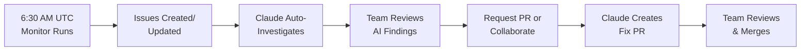

# 🤖 DA Agent Hub: AI-Powered Data Infrastructure Management

**Automated dbt error monitoring and Claude AI-powered investigation system with interactive collaboration capabilities.**

[](https://cloud.getdbt.com/)
[](https://claude.ai/)
[](https://github.com/features/actions)
[](https://snowflake.com/)

---

## 🌟 Overview

The DA Agent Hub serves **two complementary purposes** for modern data teams:

### 🔧 **1. Local Development Agent Hub**
**For developers working locally on data pipelines**

A Claude Code CLI system with specialized sub-agents that help you develop, debug, and optimize your data infrastructure locally. Think of it as having a team of expert consultants available in your terminal.

### 🤖 **2. Automated GitHub Workflows**
**For autonomous pipeline monitoring and maintenance**

A complete automated system that monitors your dbt Cloud projects for errors, creates GitHub issues with detailed context, and uses Claude AI to investigate and propose fixes—all while enabling interactive collaboration for complex problem-solving.

## 📊 **How They Work Together**

```mermaid
graph TB
    subgraph "Local Development (Purpose 1)"
        DEV[Data Engineer]
        CLI[Claude Code CLI]
        AGENTS[Specialized Agents<br/>dbt • snowflake • tableau]
        LOCAL[Local Repositories]
    end

    subgraph "Automated Operations (Purpose 2)"
        GHA[GitHub Actions<br/>Daily Monitor]
        GI[GitHub Issues<br/>Auto-Created]
        CA[Claude AI<br/>Investigation]
        PR[Auto-Generated<br/>Pull Requests]
    end

    subgraph "Data Infrastructure"
        DBT[dbt Cloud]
        SF[Snowflake]
        TB[Tableau]
    end

    %% Local Development Flow
    DEV --> CLI
    CLI --> AGENTS
    AGENTS --> LOCAL
    LOCAL --> DBT

    %% Automated Operations Flow
    DBT -->|Errors| GHA
    GHA -->|Creates| GI
    GI -->|Triggers| CA
    CA -->|Creates| PR
    PR -->|Fixes| DBT

    %% Cross-Purpose Integration
    DEV -.->|@claude mentions| GI
    AGENTS -.->|Same expertise| CA
```

### 🏗️ System Architecture

```mermaid
graph TB
    subgraph "Data Infrastructure"
        DBT[dbt Cloud]
        SF[Snowflake]
        TB[Tableau]
    end

    subgraph "Monitoring & Alerting"
        GHA[GitHub Actions<br/>Daily Monitor]
        GI[GitHub Issues<br/>Auto-Created]
    end

    subgraph "AI Investigation System"
        CA[Claude AI<br/>Investigation]
        MA[Multi-Agent<br/>Analysis]
        IC[Interactive<br/>Collaboration]
    end

    subgraph "Human Collaboration"
        DEV[Data Engineers]
        PR[Pull Requests<br/>Auto-Generated]
        FIX[Implemented Fixes]
    end

    DBT -->|Errors| GHA
    GHA -->|Creates/Updates| GI
    GI -->|Triggers| CA
    CA -->|Uses| MA
    MA -->|Analysis| IC
    IC -->|Responds to| DEV
    DEV -->|@claude mentions| IC
    IC -->|Creates| PR
    PR -->|Implements| FIX
    FIX -->|Resolves| DBT
```

## 🎯 **When to Use Each Approach**

### 🔧 **Use Local Development When:**
- **Developing new features**: Building dbt models, Tableau dashboards, or data pipelines
- **Debugging complex issues**: Need interactive, back-and-forth problem solving
- **Learning and exploration**: Want to understand your data stack better
- **Performance optimization**: Tuning queries, models, or infrastructure
- **Architecture decisions**: Planning system changes or integrations
- **Immediate assistance**: Need help right now while working

### 🤖 **Use Automated Operations When:**
- **Production monitoring**: Want 24/7 oversight of your data pipelines
- **Team collaboration**: Multiple people need to track and resolve issues
- **Consistent processes**: Want standardized issue tracking and resolution
- **Scalable maintenance**: Managing multiple projects or environments
- **Knowledge preservation**: Building institutional memory of issues and solutions
- **Proactive operations**: Catch and fix issues before they impact users

### 🔄 **Use Both Together For:**
- **Complete coverage**: Local development + production monitoring
- **Continuous learning**: Insights from production feed back into development
- **Team efficiency**: Developers use local agents, ops team uses automation
- **Knowledge sharing**: Same agent expertise across both environments

---

## 🎯 Key Features

### 🔧 **Local Development Features**

#### **Specialized Agent System**
- **dbt-expert**: SQL transformations, model optimization, test development
- **snowflake-expert**: Query performance, cost analysis, warehouse optimization
- **tableau-expert**: Dashboard development, report model analysis
- **business-context**: Requirements gathering, stakeholder alignment
- **da-architect**: System design, data flow analysis, strategic decisions
- **dlthub-expert**: Data ingestion, source system integration

#### **Local Development Tools**
- **Interactive CLI**: Claude Code integration with specialized sub-agents
- **Repository Management**: Organized workspace with symlinked repositories
- **Project Workflows**: Structured approach for complex multi-day projects
- **Knowledge Management**: Personal and team knowledge base integration
- **Custom Commands**: Tailored workflows for your specific data stack

### 🤖 **Automated Operations Features**

#### **Autonomous Monitoring**
- **Daily Error Detection**: Automated dbt Cloud monitoring at 6:30 AM UTC
- **Smart Issue Creation**: GitHub issues with comprehensive error context
- **Priority Classification**: Automatic categorization by error type and severity
- **Cross-Repository Support**: Works across multiple dbt projects

#### **AI-Powered Investigation**
- **Automatic Analysis**: Claude investigates every new issue with domain expertise
- **Multi-Agent Analysis**: Same expert agents as local development
- **Root Cause Identification**: Deep dive analysis with historical context
- **Fix Recommendations**: Specific, actionable solution proposals

#### **Interactive Collaboration**
- **@claude Mentions**: Comment on any issue to get AI assistance
- **Automatic PR Creation**: Request fixes with `@claude create PR`
- **Assignment-Based Fixing**: Assign issues to `claude[bot]` for auto-fix attempts
- **Label-Based Triggers**: Use labels like `claude:fix` and `claude:investigate`
- **Multi-Turn Conversations**: Collaborative problem-solving with context retention

---

## 🚀 Quick Start

**Choose your path based on your primary use case:**

### 🔧 **Path 1: Local Development Setup**
**For developers who want AI-powered assistance while developing locally**

#### Prerequisites
- **Claude Code CLI**: [Installation Guide](https://docs.anthropic.com/claude/docs)
- **GitHub CLI**: [Installation Guide](https://cli.github.com/manual/installation)
- **Your data repositories**: dbt, dlthub, etc.

#### Setup Steps
1. **Clone this repository**:
   ```bash
   git clone https://github.com/graniterock/da-agent-hub.git
   cd da-agent-hub
   ```

2. **Run the setup script**:
   ```bash
   ./setup.sh
   ```
   This will auto-detect your repositories and configure the agent system.

3. **Start using agents**:
   ```bash
   claude "analyze my dbt models using the dbt-expert agent"
   claude "help me optimize this Snowflake query with snowflake-expert"
   ```

### 🤖 **Path 2: Automated Operations Setup**
**For teams who want automated monitoring and AI-powered issue resolution**

#### Prerequisites
- **GitHub Repository**: Access to your dbt projects on GitHub
- **dbt Cloud**: Active dbt Cloud account with API access
- **Claude Pro/Max**: Subscription for OAuth token authentication
- **GitHub Actions**: Enabled in your repositories

#### Setup Steps

##### 1. Setup Repositories
The automated system works across **three repositories**:

1. **Your dbt Project** (e.g., `roy_kent`, `dbt_cloud`)
   - Contains dbt models, tests, and configurations
   - Gets the monitoring workflow

2. **graniterock/dbt_errors_to_issues**
   - Shared Python scripts for error processing
   - Handles dbt Cloud API integration

3. **graniterock/da-agent-hub** (this repo)
   - Claude AI investigation system
   - Interactive collaboration workflows

##### 2. Configure Secrets

Set up these GitHub repository secrets:

#### In Your dbt Project Repository:
```bash
DBT_CLOUD_API_TOKEN=your_dbt_cloud_api_token
DBT_CLOUD_ACCOUNT_ID=your_account_id
GITHUB_API_TOKEN=your_github_pat_token
```

#### In da-agent-hub Repository:
```bash
ANTHROPIC_API_KEY=your_claude_oauth_token
DBT_CLOUD_API_TOKEN=your_dbt_cloud_api_token
DBT_CLOUD_ACCOUNT_ID=your_account_id
```

### 3. Deploy Monitoring Workflow

Copy the monitoring workflow to your dbt project:

```yaml
# .github/workflows/dbt-error-monitor.yml
name: dbt Error Monitoring

on:
  schedule:
    - cron: '30 6 * * *'  # 6:30 AM UTC daily
  workflow_dispatch:

jobs:
  monitor-dbt-errors:
    runs-on: ubuntu-latest
    steps:
    - name: Checkout dbt_errors_to_issues repository
      uses: actions/checkout@v4
      with:
        repository: graniterock/dbt_errors_to_issues
        ref: main
        path: dbt-error-monitor

    - name: Set up Python
      uses: actions/setup-python@v4
      with:
        python-version: '3.11'

    - name: Install dependencies
      run: |
        cd dbt-error-monitor
        pip install -r requirements.txt

    - name: Run dbt error monitoring for your_project
      run: |
        cd dbt-error-monitor
        python run_for_project.py
      env:
        DBT_PROJECT_NAME: your_project_name
        DBT_CLOUD_API_TOKEN: ${{ secrets.DBT_CLOUD_API_TOKEN }}
        DBT_CLOUD_ACCOUNT_ID: ${{ secrets.DBT_CLOUD_ACCOUNT_ID }}
        GITHUB_API_TOKEN: ${{ secrets.GITHUB_API_TOKEN }}
        GITHUB_REPO: your_org/your_dbt_repo

    - name: Trigger Claude sleuthing for new issues
      uses: peter-evans/repository-dispatch@v3
      with:
        token: ${{ secrets.GITHUB_API_TOKEN }}
        repository: graniterock/da-agent-hub
        event-type: dbt-issue-sleuth
        client-payload: |
          {
            "repository": "your_org/your_dbt_repo",
            "project": "your_project_name",
            "trigger": "scheduled_monitoring",
            "run_id": "${{ github.run_id }}"
          }
```

---

## 🎮 Usage Guide

### 🔧 **Local Development Usage**

#### **Basic Agent Consultation**
```bash
# Get help with dbt models
claude "analyze my dbt model performance using dbt-expert"

# Optimize Snowflake queries
claude "help me optimize this query with snowflake-expert"

# Review Tableau dashboard design
claude "evaluate my dashboard with tableau-expert"

# Multi-agent analysis
claude "coordinate dbt-expert and snowflake-expert to solve this performance issue"
```

#### **Project Workflows**
```bash
# Start a complex project
/start_project

# Use agents for research
claude --agent dbt-expert "investigate model dependencies"

# Implement solutions
claude "implement the dbt-expert recommendations"
```

#### **Local Commands**
```bash
# Check system status
/status

# Setup workspace
./setup.sh

# Manage repositories
./scripts/manage-workspace.sh list
```

### 🤖 **Automated Operations Usage**

#### **@claude Mentions**
Comment on any GitHub issue to get Claude's help:

```bash
# Request a fix
@claude create PR to resolve this unique constraint issue

# Deep investigation
@claude investigate the upstream data quality for this model

# General discussion
@claude what do you think is causing these test failures?

# Collaborative debugging
@claude I think this might be related to the ERP data load timing, can you check?
```

#### **Assignment-Based Auto-Fix**
Assign any issue to `claude[bot]` and Claude will:
1. Analyze the problem thoroughly
2. Determine if it's suitable for auto-fixing
3. Create a PR with the solution (for simple fixes)
4. Or explain why manual intervention is needed (for complex issues)

#### **Label-Based Triggers**
Add labels to issues for specific actions:

- 🏷️ **`claude:fix`**: Create a pull request with a fix
- 🏷️ **`claude:investigate`**: Perform deeper analysis
- 🏷️ **`claude:collaborate`**: Start interactive discussion mode

### 📊 **Purpose Comparison**

| Aspect | 🔧 Local Development | 🤖 Automated Operations |
|--------|---------------------|-------------------------|
| **Primary User** | Data engineers developing locally | Teams wanting autonomous monitoring |
| **When Used** | During development, debugging, optimization | 24/7 automated monitoring and response |
| **Interaction** | Direct CLI commands and agent consultation | GitHub issues, comments, and PR workflows |
| **Agent Access** | Same specialized agents via Claude Code CLI | Same agents via GitHub Actions workflows |
| **Repository Scope** | Your local workspace and repositories | Cross-repository GitHub automation |
| **Response Time** | Immediate (seconds) | Automated (minutes to hours) |
| **Use Cases** | Feature development, debugging, optimization | Error monitoring, issue resolution, maintenance |
| **Setup Complexity** | Simple (clone + setup script) | Moderate (workflows + secrets + repositories) |
| **Cost Model** | Personal Claude subscription | Team GitHub Actions + Claude subscription |

### 📊 Automated Daily Workflow



### 🔧 Automated Operations Examples

#### **Scenario 1: Simple Fix Request**
```
You: @claude create PR to fix the unique constraint violation

Claude: I'll analyze the bt4_rpt_stock_receipt_reconciliation model
and create a PR. Let me check the duplicate records and implement
a deduplication solution.

→ Creates PR: "fix: deduplicate primary keys in stock receipt model"
  - Adds DISTINCT clause to staging model
  - Updates test configuration
  - Includes documentation updates
```

#### **Scenario 2: Collaborative Investigation**
```
You: @claude I think this might be related to the upstream ERP data
timing. Can you investigate that angle?

Claude: Great insight! Let me investigate the upstream data patterns
using the dlthub-expert agent to check source ingestion timing...

→ Updates issue with:
  - ERP data load schedule analysis
  - Timing conflict identification
  - Recommended schedule adjustments
  - Pipeline health assessment
```

#### **Scenario 3: Auto-Fix Assignment**
```
Action: You assign issue to claude[bot]

Claude: I've been assigned to fix this issue. Analyzing...
- Found duplicate primary keys in stock receipt data
- Root cause: Missing deduplication in staging model
- This is a simple fix appropriate for auto-implementation
- Creating PR with solution...

→ Automatically creates and links PR with fix
```

---

## 🏛️ System Architecture

### 🔄 Data Flow

1. **Detection Phase**: dbt Cloud runs daily tests and transformations
2. **Monitoring Phase**: GitHub Actions monitors dbt Cloud API for failures
3. **Issue Management**: Creates/updates GitHub issues with detailed error context
4. **AI Trigger**: Automatically dispatches investigation request to Claude
5. **Investigation Phase**: Claude analyzes using specialized expert agents
6. **Collaboration Phase**: Users interact via comments, assignments, or labels
7. **Resolution Phase**: Claude creates PRs with fixes or provides guidance

### 🧠 Multi-Agent Intelligence

The system leverages **specialized AI agents** for domain expertise:

```
┌─────────────────┐    ┌──────────────────┐    ┌─────────────────┐
│   dbt-expert    │    │ snowflake-expert │    │ tableau-expert  │
│                 │    │                  │    │                 │
│ • SQL Logic     │    │ • Query Perf     │    │ • Dashboard     │
│ • Model Tests   │    │ • Cost Analysis  │    │   Performance   │
│ • Dependencies  │    │ • Schema Issues  │    │ • Report Models │
└─────────────────┘    └──────────────────┘    └─────────────────┘

┌─────────────────┐    ┌──────────────────┐    ┌─────────────────┐
│business-context │    │   da-architect   │    │ dlthub-expert   │
│                 │    │                  │    │                 │
│ • Requirements  │    │ • System Design  │    │ • Data Ingestion│
│ • Stakeholder   │    │ • Cross-Platform │    │ • Source Quality│
│   Alignment     │    │   Decisions      │    │ • Connectors    │
└─────────────────┘    └──────────────────┘    └─────────────────┘
```

### 🔐 Security & Authentication

- **dbt Cloud API**: Account-specific tokens with environment-level permissions
- **GitHub Actions**: Classic Personal Access Tokens for cross-repository access
- **Claude AI**: OAuth token authentication (requires Claude Pro/Max subscription)
- **Secrets Management**: All credentials stored as encrypted GitHub repository secrets
- **Least Privilege**: Each component has minimal required permissions

---

## 💰 Cost Analysis

### **Annual Operating Costs: $0-100**

| Component | Cost | Notes |
|-----------|------|-------|
| **GitHub Actions** | $0 | Free tier covers typical usage (2,000 minutes/month) |
| **Claude API** | $0 | OAuth token uses existing Claude Pro/Max subscription |
| **dbt Cloud API** | $0 | Read-only access, no additional charges |
| **Repository Storage** | $0 | Normal GitHub repository limits |
| **Total Annual** | **$0-100** | May incur small costs for heavy usage |

### **ROI Benefits**
- **Reduced MTTR**: Issues resolved 50-80% faster with AI guidance
- **Proactive Detection**: Catch problems hours vs. days after occurrence
- **Team Efficiency**: Data engineers focus on implementation vs. diagnosis
- **Knowledge Preservation**: Investigation findings become searchable institutional knowledge

---

## 🛠️ Advanced Configuration

### Cross-Repository Setup

For organizations with multiple dbt projects:

1. **Central Hub**: One da-agent-hub repository for all AI investigation
2. **Project-Specific Monitoring**: Each dbt repository gets its own monitoring workflow
3. **Shared Scripts**: Single dbt_errors_to_issues repository handles all projects
4. **Unified Intelligence**: Claude provides consistent analysis across projects

### Custom Agent Development

Extend the system with custom agents:

```markdown
# .claude/agents/custom-expert.md

You are a specialized expert for [your domain].

## Capabilities
- Domain-specific analysis
- Custom tool integration
- Specialized knowledge base

## When to Use
- Issue involves [specific conditions]
- Complex [domain] problems
- Cross-system [domain] analysis

## Analysis Framework
1. [Domain-specific step 1]
2. [Domain-specific step 2]
3. [Domain-specific step 3]
```

### Integration with CI/CD

Enhance your deployment pipeline:

```yaml
# Add to your CI/CD workflow
- name: Trigger Pre-Deployment Analysis
  if: contains(github.head_ref, 'claude/')
  uses: peter-evans/repository-dispatch@v3
  with:
    repository: graniterock/da-agent-hub
    event-type: pre-deployment-analysis
    client-payload: |
      {
        "pr_number": "${{ github.event.number }}",
        "branch": "${{ github.head_ref }}",
        "analysis_type": "pre_deployment"
      }
```

---

## 🧪 Testing & Validation

### Test the System

1. **Create a test dbt issue**:
   ```bash
   gh issue create --title "Test Claude Collaboration" \
     --body "Testing the AI investigation system"
   ```

2. **Trigger Claude investigation**:
   ```bash
   # Comment on the issue
   @claude investigate this test issue and demonstrate system capabilities
   ```

3. **Verify workflow execution**:
   ```bash
   gh run list --limit 5
   ```

### Health Checks

Monitor system health:

```bash
# Check workflow status
gh run list --workflow="dbt Error Monitoring" --limit 3

# Verify Claude authentication
gh run list --workflow="Claude Collaborative Fixes" --limit 3

# Review recent issues
gh issue list --label="dbt-error" --limit 5
```

---

## 🚨 Troubleshooting

### Common Issues

| Problem | Symptoms | Solution |
|---------|----------|----------|
| **Workflow not triggering** | No new runs after @claude mention | Check workflow is on main branch |
| **Authentication failed** | "Invalid API key" error | Verify OAuth token in secrets |
| **No issues created** | dbt errors but no GitHub issues | Check dbt Cloud API permissions |
| **Claude not responding** | Workflow runs but no comments | Verify ANTHROPIC_API_KEY secret |

### Debug Steps

1. **Check workflow files**:
   ```bash
   ls -la .github/workflows/
   ```

2. **Verify secrets**:
   ```bash
   gh secret list
   ```

3. **Review workflow logs**:
   ```bash
   gh run view --log-failed
   ```

4. **Test API connectivity**:
   ```bash
   curl -H "Authorization: Bearer $DBT_TOKEN" \
     "https://cloud.getdbt.com/api/v2/accounts/$ACCOUNT_ID/"
   ```

---

## 🎯 Best Practices

### For Data Teams

1. **Proactive Monitoring**: Review daily AI investigations to catch patterns
2. **Collaborative Debugging**: Use @claude mentions for complex issues
3. **Knowledge Building**: Let Claude document solutions for future reference
4. **Gradual Automation**: Start with investigation, progress to auto-fixing

### For Claude Interactions

1. **Be Specific**: "Investigate unique constraint violations in dim_customer"
2. **Provide Context**: "This started after yesterday's ERP data load"
3. **Ask Follow-ups**: "What about impact on downstream dashboards?"
4. **Request Actions**: "Create a PR to fix this" vs. "What should we do?"

### for System Administration

1. **Regular Health Checks**: Monitor workflow success rates
2. **Token Rotation**: Update API tokens before expiration
3. **Capacity Planning**: Monitor GitHub Actions usage
4. **Security Auditing**: Review access logs periodically

---

## 🔮 Future Enhancements

### Planned Features
- **Slack Integration**: Real-time notifications and interactions
- **Tableau Dashboard**: System health and metrics visualization
- **Advanced Analytics**: Pattern recognition across historical issues
- **Auto-Deployment**: Safe automatic deployment of simple fixes
- **Multi-Cloud Support**: AWS, GCP, Azure data platforms

### Contributing

We welcome contributions! Areas for enhancement:

- Custom agent development
- Additional data platform integrations
- Enhanced error pattern recognition
- Improved auto-fix capabilities
- Documentation and examples

---

## 📚 Documentation

### Quick References
- **[Claude Interaction Guide](docs/claude-interactions.md)**: Complete command reference
- **[Agent Development](docs/agent-development.md)**: Creating custom experts
- **[Workflow Configuration](docs/workflow-config.md)**: Setup and customization
- **[Troubleshooting Guide](docs/troubleshooting.md)**: Common issues and solutions

### External Resources
- [dbt Cloud API Documentation](https://docs.getdbt.com/dbt-cloud/api-v2)
- [Claude Code Documentation](https://docs.anthropic.com/claude/docs)
- [GitHub Actions Documentation](https://docs.github.com/en/actions)

---

## 📞 Support & Community

- **Issues**: [GitHub Issues](https://github.com/graniterock/da-agent-hub/issues)
- **Documentation**: [Wiki](https://github.com/graniterock/da-agent-hub/wiki)
- **Discussions**: [GitHub Discussions](https://github.com/graniterock/da-agent-hub/discussions)

---

## 📄 License

MIT License - See [LICENSE](LICENSE) for details.

---

**Built with ❤️ for data teams who want AI-powered infrastructure management**

*Transform your reactive error handling into proactive, intelligent data operations.*