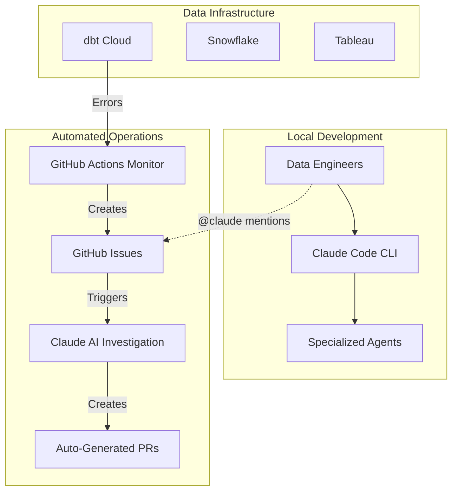

# 🤖 DA Agent Hub: AI-Powered Data Infrastructure Management

**Automated dbt error monitoring and Claude AI-powered investigation system with interactive collaboration capabilities.**

[](https://cloud.getdbt.com/)
[](https://claude.ai/)
[](https://github.com/features/actions)
[](https://snowflake.com/)

---

## 🌟 Overview

The DA Agent Hub serves **two complementary purposes** for modern data teams:

### 🔧 **Local Development Agent Hub**
A Claude Code CLI system with specialized sub-agents (dbt-expert, snowflake-expert, tableau-expert) that help you develop, debug, and optimize your data infrastructure locally.

### 🤖 **Automated GitHub Workflows**
A complete automated system that monitors your dbt Cloud projects for errors, creates GitHub issues with detailed context, and uses Claude AI to investigate and propose fixes through interactive collaboration.

## 📊 System Architecture



---

## 🚀 Quick Start

### 🔧 **Local Development Setup**
**For developers who want AI-powered assistance while developing locally**

1. **Clone and setup**:
   ```bash
   git clone https://github.com/graniterock/da-agent-hub.git
   cd da-agent-hub
   ./setup.sh
   ```

2. **Start using agents**:
   ```bash
   claude "analyze my dbt models using dbt-expert"
   claude "optimize this Snowflake query with snowflake-expert"
   ```

**Prerequisites**: Claude Code CLI, GitHub CLI, your data repositories

### 🤖 **Automated Operations Setup**
**For teams who want automated monitoring and AI-powered issue resolution**

1. **Configure secrets** in your dbt repository:
   ```bash
   DBT_CLOUD_API_TOKEN=your_token
   DBT_CLOUD_ACCOUNT_ID=your_id
   GITHUB_API_TOKEN=your_github_token
   ```

2. **Deploy monitoring workflow** to your dbt project (`.github/workflows/dbt-error-monitor.yml`)

3. **Configure da-agent-hub secrets**:
   ```bash
   ANTHROPIC_API_KEY=your_claude_oauth_token
   ```

**Prerequisites**: GitHub repository, dbt Cloud account, Claude Pro/Max subscription

---

## 🎮 Usage Examples

### 🔧 **Local Development**
```bash
# Basic agent consultation
claude "coordinate dbt-expert and snowflake-expert to solve this performance issue"

# Project workflows
/start_project
claude --agent dbt-expert "investigate model dependencies"
```

### 🤖 **Automated Operations**
```bash
# Comment on any GitHub issue
@claude create PR to resolve this unique constraint issue
@claude investigate the upstream data quality for this model

# Assign issues to claude[bot] for auto-fixing
# Add labels: claude:fix, claude:investigate, claude:collaborate
```

---

## 🎯 Key Features

### **Specialized Agent System**
- **dbt-expert**: SQL transformations, model optimization, test development
- **snowflake-expert**: Query performance, cost analysis, warehouse optimization
- **tableau-expert**: Dashboard development, report model analysis
- **business-context**: Requirements gathering, stakeholder alignment
- **da-architect**: System design, data flow analysis, strategic decisions
- **dlthub-expert**: Data ingestion, source system integration

### **Automated Operations**
- **Daily Error Detection**: 6:30 AM UTC monitoring with smart issue creation
- **AI-Powered Investigation**: Automatic analysis with domain expertise
- **Interactive Collaboration**: @claude mentions, assignment-based fixing, label triggers
- **Auto-Generated PRs**: Request fixes with collaborative problem-solving

### **Cross-Repository Intelligence**
- Works across multiple dbt projects with unified analysis
- Same expert agents available in both local development and automated operations
- Knowledge preservation and institutional memory building

---

## 💰 Cost & ROI

**Annual Operating Costs**: $0-100 (GitHub Actions free tier + existing Claude subscription)

**Benefits**: 50-80% faster issue resolution, proactive detection, enhanced team efficiency

---

## 📚 Documentation & Support

- **[Detailed Setup Guide](docs/setup.md)**: Complete installation and configuration
- **[Claude Interaction Guide](docs/claude-interactions.md)**: Command reference and best practices
- **[Agent Development](docs/agent-development.md)**: Creating custom experts
- **[Troubleshooting](docs/troubleshooting.md)**: Common issues and solutions

**External Resources**: [dbt Cloud API](https://docs.getdbt.com/dbt-cloud/api-v2) • [Claude Code](https://docs.anthropic.com/claude/docs) • [GitHub Actions](https://docs.github.com/en/actions)

---

## 🤝 Support & Community

- **Issues**: [GitHub Issues](https://github.com/graniterock/da-agent-hub/issues)
- **Discussions**: [GitHub Discussions](https://github.com/graniterock/da-agent-hub/discussions)

---

**Built with ❤️ for data teams who want AI-powered infrastructure management**

*Transform your reactive error handling into proactive, intelligent data operations.*