# 🤖 DA Agent Hub: Analytics Development Lifecycle (ADLC) AI Platform

> 🎯 **Showcase Portfolio Project** - See [SHOWCASE.md](SHOWCASE.md) for detailed value demonstration and technical highlights.
>
> This fork demonstrates an AI-powered Analytics Development Lifecycle platform. Original work developed at GraniteRock, sanitized for public sharing.

**Complete implementation of the [dbt Analytics Development Lifecycle](https://www.getdbt.com/resources/the-analytics-development-lifecycle) with AI-powered automation across all eight phases.**

[](https://cloud.getdbt.com/)
[](https://claude.ai/)
[](https://github.com/features/actions)
[](https://snowflake.com/)

---

## 🧭 Quick Navigation

**🎯 Start Here:**
- [**SHOWCASE.md**](SHOWCASE.md) - Why I built this, technical deep-dive, real-world impact
- [**4-Command Workflow**](#-quick-start-4-simple-commands) - Get started in 60 seconds
- [**Architecture Diagrams**](#-adlc-implementation-architecture) - Visual system overview

**🔍 Explore by Interest:**
- **For Recruiters/Managers:** [SHOWCASE.md](SHOWCASE.md) → [Real-World Impact](#-real-world-impact) → [Key Innovations](SHOWCASE.md#-key-innovations-im-proud-of)
- **For Data Engineers:** [Role-Based Agents](#-adlc-developtestdeploy-local-development--project-management) → [MCP Architecture](#️-mcp-architecture-status-week-1-complete-) → [Agent Definitions](.claude/agents/)
- **For AI Enthusiasts:** [Specialist Architecture](SHOWCASE.md#1️⃣-role-based-ai-specialist-system) → [MCP Integration](#️-mcp-architecture-status-week-1-complete-) → [Prompt Engineering](.claude/agents/specialists/)
- **Want to Fork This:** [Installation](#-getting-started) → [Security Guide](FORK_MAINTENANCE.md) → [Customization](#framework-customization)

---

## 🌟 Framework Overview

The DA Agent Hub is an open-source framework that transforms how data teams approach analytics development. It combines the industry-standard dbt Analytics Development Lifecycle with AI-powered automation to create a seamless workflow from ideation to production operations.

**Perfect for:**
- Data teams wanting to standardize their development workflow
- Organizations implementing or optimizing their modern data stack
- Teams looking to integrate AI assistance into their analytics processes
- Anyone seeking a structured approach to data project management

## 🎯 Why DA Agent Hub?

### The Problem
Data teams often struggle with:
- **Scattered Ideas**: Good ideas get lost in Slack threads and meeting notes
- **Project Overhead**: Setting up analytics projects requires significant manual work
- **Knowledge Silos**: Domain expertise trapped with individual team members
- **Reactive Operations**: Issues discovered after they impact business users

### The Solution
DA Agent Hub provides:
- **Structured Ideation**: Systematic capture and organization of data initiatives
- **AI-Powered Development**: Specialist agents with deep domain expertise
- **Automated Operations**: Proactive monitoring and intelligent issue resolution
- **Knowledge Preservation**: Institutional memory that grows with every project

### The Result
- 🚀 **Faster Time-to-Value**: From idea to production in a structured, repeatable way
- 🤖 **AI-Enhanced Quality**: Specialist agents ensure best practices across your stack
- 📊 **Proactive Operations**: Issues caught and resolved before users notice
- 🎓 **Team Learning**: Continuous improvement through automated knowledge capture

---

## 🏗️ MCP Architecture Status (Week 1 COMPLETE ✅)

The DA Agent Hub is undergoing a **12-week transformation** to integrate Model Context Protocol (MCP) servers with specialist agents for data-driven, expert-validated decision-making.

### ✅ Week 1: Foundation & Testing (COMPLETE)

**MCP Servers Operational (8/8 - 100%)**
- ✅ **dbt-mcp**: Transformation layer access
- ✅ **snowflake-mcp**: Data warehouse operations
- ✅ **aws-api**: AWS infrastructure management
- ✅ **aws-docs**: AWS documentation search
- ✅ **github**: Repository operations
- ✅ **slack**: Team communication
- ✅ **filesystem**: Local file access
- ✅ **sequential-thinking**: Complex reasoning

**Specialists Operational (4)**
- ✅ **aws-expert**: AWS infrastructure (aws-api + aws-docs + aws-knowledge MCP)
- ✅ **dbt-expert**: SQL transformations (dbt-mcp + snowflake-mcp + github-mcp)
- ✅ **snowflake-expert**: Warehouse optimization (snowflake-mcp + dbt-mcp)
- ✅ **github-sleuth-expert**: Issue investigation (github-mcp + context resolution)

**Key Achievements**
- ✅ All MCP servers authenticated via 1Password
- ✅ Smart repository context resolution (13+ repos)
- ✅ GitHub Sleuth Expert revived with MCP integration
- ✅ Comprehensive testing and validation complete
- ✅ Pattern documentation for future specialists

**Architecture Pattern**
```
Role Agent (primary)
    ↓ Delegates when confidence <0.60 OR expertise needed
Specialist (expert)
    ├─ Uses MCP tools (data access)
    ├─ Applies domain expertise (synthesis, validation)
    └─ Returns validated recommendation
Role Agent
    └─ Executes with confidence
```

**See**: Issue #88 for complete 12-week transformation roadmap

---

## 🚀 Quick Start: 4 Simple Commands

**Never used this before? Here's how to go from idea to production:**

### 1️⃣ **Capture Ideas** → `/capture "your idea"`
Brainstorming with your team? Just throw ideas at Claude and they get saved automatically:
```bash
claude /capture "We need a real-time sales dashboard"
```
*That's it. No forms, no tickets. When you've captured 3+ ideas, Claude auto-organizes them into themes.*

### 2️⃣ **Plan Your Quarter** → `/roadmap quarterly`
Need to prioritize? Get an impact vs. effort analysis:
```bash
claude /roadmap quarterly
```
*Claude creates a strategic plan showing which ideas give you the biggest bang for your buck.*

### 3️⃣ **Build Something** → `/build "idea-name"`
Ready to execute? Turn your idea into a full project structure:
```bash
claude /build "real-time-sales-dashboard"
```
*Creates a complete project folder with AI agents ready to help build it. Sets up git branches, coordinates specialists, the whole nine yards.*

### 4️⃣ **Ship It** → `/complete "project-name"`
Done building? Archive the project and clean up:
```bash
claude /complete "feature-real-time-sales-dashboard"
```
*Handles git workflow, archives documentation, updates related ideas. Everything gets documented for the next person.*

**That's the entire workflow.** Four commands that handle everything from "shower thought" to "running in production."

### 💡 Optional: Better Context Switching
Working on multiple projects? Set up isolated VS Code workspaces:
```bash
claude /setup-worktrees
```
*One-time setup. Now each `/build` creates a dedicated VS Code window with zero context contamination.*

---

## 🔄 Analytics Development Lifecycle Integration

The DA Agent Hub implements all eight ADLC phases through three integrated AI layers:

### 💡 **Layer 1: PLAN Phase**
**Ideation & Strategic Planning** - Business case validation, implementation planning, stakeholder feedback, impact analysis

### 🔧 **Layer 2: DEVELOP + TEST + DEPLOY Phases**
**Local Development & Project Management** - Human-readable code, flexible workflows, quality assurance, automated deployment

### 🤖 **Layer 3: OPERATE + OBSERVE + DISCOVER + ANALYZE Phases**
**Automated Operations & Intelligence** - 24/7 monitoring, performance tracking, artifact discovery, business insights

## 📊 ADLC Implementation Architecture

### High-Level: The 4-Command Workflow

```mermaid
graph LR
    A[💡 /idea<br/>Capture] --> B[🗺️ /roadmap<br/>Prioritize]
    B --> C[🚀 /start<br/>Build]
    C --> D[✅ /complete<br/>Ship]
    D -.->|Next Project| B

    style A fill:#e1f5ff
    style B fill:#fff4e1
    style C fill:#e8f5e9
    style D fill:#f3e5f5
```



**That's it.** Four commands handle your entire analytics development lifecycle.

### Detailed: Three-Layer Architecture

```mermaid
graph TB
    subgraph "💡 Layer 1: PLAN"
        IDEA["/idea → GitHub Issue<br/>Auto-labeled & organized"]
        ROADMAP["/roadmap → Impact Analysis<br/>Prioritization matrix"]
    end

    subgraph "🔧 Layer 2: DEVELOP"
        START["/start → Project Setup<br/>Git worktree + specialists"]
        AGENTS["Role Agents<br/>analytics-engineer, data-engineer, bi-developer"]
        MCP["MCP Specialists<br/>dbt-expert, snowflake-expert, aws-expert"]
    end

    subgraph "🤖 Layer 3: OPERATE"
        MONITOR["GitHub Actions<br/>Daily monitoring"]
        INVESTIGATE["AI Investigation<br/>Root cause analysis"]
        FIX["Automated PRs<br/>Cross-repo fixes"]
    end

    IDEA --> ROADMAP
    ROADMAP --> START
    START --> AGENTS
    AGENTS --> MCP
    MCP -.-> MONITOR
    MONITOR --> INVESTIGATE
    INVESTIGATE --> FIX

    style IDEA fill:#e1f5ff
    style ROADMAP fill:#e1f5ff
    style START fill:#e8f5e9
    style AGENTS fill:#e8f5e9
    style MCP fill:#e8f5e9
    style MONITOR fill:#fff3e0
    style INVESTIGATE fill:#fff3e0
    style FIX fill:#fff3e0
```



---

## 🛠️ Getting Started

### Prerequisites
- **Claude Code CLI**: [Installation Guide](https://docs.claude.com/en/docs/claude-code)
- **Git**: Version control for project management
- **Modern Data Stack**: dbt, Snowflake, and/or similar tools (optional for framework exploration)

### Installation
```bash
# 1. Clone the repository
git clone https://github.com/yourusername/da-agent-hub.git
cd da-agent-hub

# 2. Make scripts executable
chmod +x scripts/*.sh

# 3. Start using immediately - no complex setup required!
./scripts/capture.sh "Your first idea for testing the framework"
```

### Framework Customization
The DA Agent Hub is designed to be adaptable to your organization's needs:

1. **Modify Agent Expertise**: Update `.claude/agents/*.md` files for your domain
2. **Customize Workflows**: Adapt `scripts/*.sh` for your development processes
3. **Configure Integrations**: Set up connections to your specific data tools
4. **Extend Documentation**: Add your organization's standards to `knowledge/`

---

## 🚀 Complete ADLC Workflow Guide

### **💡 ADLC PLAN Phase** (Layer 1)
Business case validation and implementation planning:

```bash
# 1. Business case validation - capture problems and opportunities
./scripts/capture.sh "Create ML-powered customer churn prediction model"
# OR: claude /capture "Create ML-powered customer churn prediction model"
./scripts/capture.sh "Real-time data quality monitoring dashboard"
./scripts/capture.sh "Optimize Snowflake costs with automated scaling"
# → Auto-organizes when 3+ ideas captured

# 2. Strategic planning - impact analysis and prioritization
./scripts/roadmap.sh quarterly
# OR: claude /roadmap quarterly
# → Creates prioritization matrix with impact vs effort analysis

# 3. Project execution - build highest priority ideas
./scripts/build.sh "customer-churn-prediction"
# OR: claude /build "customer-churn-prediction"
# → Creates: projects/active/feature-customer-churn-prediction/

# 4. Project completion - archive and cleanup
./scripts/finish.sh "feature-customer-churn-prediction"
# OR: claude /finish "feature-customer-churn-prediction"
# → Archives project, updates related ideas, handles git workflow
```

### **🔧 ADLC DEVELOP + TEST + DEPLOY Phases** (Layer 2)
Human-readable code, quality assurance, and automated deployment:

```bash
# DEVELOP: Human-readable code with role-based agents
claude "use analytics-engineer-role to create readable customer churn models"
claude "coordinate data-engineer-role for pipeline setup"
claude "work with bi-developer-role for dashboard specifications"

# TEST: Comprehensive testing strategy (unit, data, integration)
claude "implement data quality tests with validation framework"

# DEPLOY: Automated deployment processes
./scripts/work-init.sh feature "customer-analytics-deployment"
./scripts/work-complete.sh feature-customer-analytics
```

### **🤖 ADLC OPERATE + OBSERVE + DISCOVER + ANALYZE Phases** (Layer 3)
24/7 operations, monitoring, discovery, and business insights:

```bash
# OPERATE: 24/7 system availability via GitHub Actions
# OBSERVE: Performance monitoring and metrics tracking
# DISCOVER: Cross-repo artifact exploration and analysis
# ANALYZE: Business insight generation and documentation

# Interact with operational intelligence:
@claude investigate this data quality issue      # DISCOVER
@claude analyze impact of schema changes        # ANALYZE
@claude create PR to optimize performance       # OPERATE
```

---

## 💡 ADLC PLAN Phase: Idea Management ("Spaghetti Organizer")

### Quick Setup
```bash
git clone https://github.com/yourusername/da-agent-hub.git
cd da-agent-hub
# System is ready - start capturing ideas immediately!
```

### Core Workflow
1. **Capture**: Brain-dump ideas in under 30 seconds
2. **Organize**: AI clusters related concepts into themes
3. **Plan**: Quarterly roadmaps with priority scoring
4. **Promote**: Transition to structured project execution
5. **Export**: Strategic summaries for ClickUp/stakeholders

### Directory Structure
```
ideas/
├── inbox/           # Raw idea capture
├── organized/       # AI-clustered themes
├── quarterly/       # Strategic planning
├── pipeline/        # Ready for projects
└── templates/       # Standardized formats
```

## 🔧 ADLC DEVELOP/TEST/DEPLOY: Local Development & Project Management

### Role-Based Agent System

**Primary Agents** (Handle 80% of work independently):
- **analytics-engineer-role**: Data transformations, modeling, SQL optimization (dbt + Snowflake + BI data)
- **data-engineer-role**: Pipeline setup, ingestion, orchestration (Orchestra + dlthub + Prefect + Airbyte)
- **bi-developer-role**: Enterprise BI dashboards, reports (Tableau + Power BI)
- **ui-ux-developer-role**: Web applications, custom tools (Streamlit + React)
- **data-architect-role**: System design, strategic platform decisions
- **business-analyst-role**: Requirements gathering, stakeholder alignment
- **qa-engineer-role**: Testing strategies, data quality validation
- **project-manager-role**: Delivery coordination, UAT frameworks

**Tool Specialists** (Consultation for complex 20% edge cases):
- Available: dbt-expert, snowflake-expert, tableau-expert, streamlit-expert, react-expert, dlthub-expert, orchestra-expert, prefect-expert

### Project Workflow
```bash
# Build idea into structured project
./scripts/build.sh "data-quality-monitoring"

# Creates complete project structure:
projects/active/feature-data-quality-monitoring/
├── spec.md           # Enhanced from organized idea
├── context.md        # Dynamic state tracking
├── tasks/           # Agent coordination
└── README.md        # Navigation hub
```

---

## 🤖 ADLC OPERATE/OBSERVE/DISCOVER/ANALYZE: Automated Operations

### GitHub Actions Integration
**Monitor your data stack and auto-resolve issues:**

1. **Configure dbt repository secrets**:
   ```bash
   DBT_CLOUD_API_TOKEN=your_token
   DBT_CLOUD_ACCOUNT_ID=your_id
   GITHUB_API_TOKEN=your_github_token
   ```

2. **Deploy monitoring workflow** to your dbt project
3. **Configure da-agent-hub secrets**:
   ```bash
   ANTHROPIC_API_KEY=your_claude_oauth_token
   ```

### Automated Capabilities
- **Error Detection**: Daily dbt Cloud monitoring at 6:30 AM UTC
- **AI Investigation**: Automatic analysis with specialist agent expertise
- **Cross-Repo Fixes**: PRs spanning dbt, Snowflake, Tableau repositories
- **Context Preservation**: Links back to original ideas and projects

---

## 🎮 Complete Usage Examples

### 💡 **Simplified: Ideation to Production Workflow**
```bash
# 0. One-time setup: VS Code worktree integration (optional but recommended)
claude /setup-worktrees
# → Configures VS Code for dedicated project instances

# 1. Team brainstorming session (< 30 seconds each)
claude /capture "Create real-time customer behavior analytics dashboard"
claude /capture "Implement automated data freshness alerts"
claude /capture "Build customer segment prediction model"
# → Auto-organizes into themes when 3+ ideas captured

# 2. Strategic planning and prioritization
claude /roadmap quarterly
# → Creates impact vs effort analysis and execution plan

# 3. Execute highest priority idea
claude /build "customer-behavior-analytics"
# → Creates: projects/active/feature-customer-behavior-analytics/
# → Creates worktree with dedicated VS Code workspace (if setup complete)
# → Prompts to launch isolated VS Code instance

# 4. Complete project
claude /complete "feature-customer-behavior-analytics"
# → Archives, handles git workflow, updates related ideas
# → Cleans up worktree and VS Code workspace

# 5. Role-based agent coordination
claude "use analytics-engineer-role and bi-developer-role for customer dashboard implementation"

# 6. Agent training and continuous improvement
./scripts/analyze-claude-chats.sh
# → Analyzes conversation patterns → Generates improvement recommendations → Enhanced agents

# 7. Automated monitoring catches issues
# GitHub Actions detect errors → Claude investigates → Cross-repo PRs created

# Note: All slash commands use underlying .sh scripts:
# /capture → ./scripts/capture.sh
# /roadmap → ./scripts/roadmap.sh
# /build → ./scripts/build.sh
# /complete → ./scripts/finish.sh
# /setup-worktrees → ./scripts/setup-worktrees.sh
```

### 🔧 **Development Workflows**
```bash
# Project management
./scripts/work-init.sh feature "ml-customer-segmentation"
claude "use data-architect-role to design the ML pipeline architecture"
./scripts/work-complete.sh feature-ml-customer-segmentation

# Role-based agent specialization
claude "analytics-engineer-role: optimize these customer models for performance"
claude "data-engineer-role: set up the customer data pipeline"
claude "bi-developer-role: design executive dashboard mockups"
```

### 🤖 **Automated Operations**
```bash
# GitHub issue interactions
@claude create PR to resolve this unique constraint issue
@claude investigate the upstream data quality for this model
@claude coordinate fix across dbt_cloud and snowflake repos

# Automated workflows
# Daily 6:30 AM UTC: dbt Cloud monitoring
# Error detection → Issue creation → AI investigation → PR generation
```

---

## 🎯 Key Features

### **💡 Ideation & Planning System**
- **Rapid Idea Capture**: Brain-dump concepts in under 30 seconds
- **AI Organization**: Claude clusters raw ideas into coherent themes
- **Strategic Planning**: Quarterly roadmaps with impact/effort analysis
- **Smart Promotion**: Seamless transition from ideas to structured projects
- **ClickUp Integration**: Export strategic summaries for stakeholder visibility

### **🔧 Development & Project Management**
- **Role-Based Agent System**: 7 primary role agents (analytics engineer, data engineer, BI developer, etc.)
- **Structured Projects**: Complete project lifecycle with spec, context, and coordination
- **Cross-Repository Work**: Coordinate changes across multiple data repositories
- **Knowledge Preservation**: Full context linking from ideas to implementation

### **🤖 Automated Operations & Monitoring**
- **Daily Error Detection**: 6:30 AM UTC dbt Cloud monitoring
- **AI-Powered Investigation**: Automatic analysis with specialist agent expertise
- **Cross-Repo Intelligence**: PRs spanning dbt, Snowflake, Tableau repositories
- **Interactive Collaboration**: @claude mentions for issue resolution

### **🎓 Intelligent Agent Training System**
- **Automated Learning**: Analyzes Claude conversations to improve agent effectiveness
- **Privacy-Preserving**: Personal chat analysis stays local, anonymized insights shared
- **Continuous Improvement**: Agents get smarter with every project completed
- **Data-Driven Enhancements**: Recommendations based on real usage patterns

### **🌐 Cross-Layer Intelligence**
- **Context Preservation**: Ideas link to projects link to operational fixes
- **Agent Consistency**: Same specialist expertise across all three layers
- **Workflow Integration**: Smooth handoffs from planning → development → operations
- **Knowledge Building**: Institutional memory grows with each cycle

---

## 📚 Documentation & Support

- **[Detailed Setup Guide](knowledge/da-agent-hub/development/setup.md)**: Complete installation and configuration
- **[Claude Interaction Guide](knowledge/da-agent-hub/development/claude-interactions.md)**: Command reference and best practices
- **[Snowflake MCP Integration](docs/snowflake-mcp-integration.md)**: Direct Snowflake database access and Cortex AI integration
- **[Agent Development](knowledge/da-agent-hub/development/agent-development.md)**: Creating custom experts
- **[Troubleshooting](knowledge/da-agent-hub/operations/troubleshooting.md)**: Common issues and solutions

**External Resources**: [dbt Cloud API](https://docs.getdbt.com/dbt-cloud/api-v2) • [Claude Code](https://docs.anthropic.com/claude/docs) • [GitHub Actions](https://docs.github.com/en/actions)

---

## 🤝 Support & Community

- **Issues**: [GitHub Issues](https://github.com/yourusername/da-agent-hub/issues)
- **Discussions**: [GitHub Discussions](https://github.com/yourusername/da-agent-hub/discussions)

---

## 📈 Real-World Impact

Teams using DA Agent Hub report:
- **70% faster project setup** with automated structure and coordination
- **50% reduction in repeated issues** through AI-powered monitoring
- **Improved knowledge retention** with systematic documentation
- **Better stakeholder alignment** through structured ideation workflows

## 🔗 Related Projects

- **[dbt](https://github.com/dbt-labs/dbt-core)**: Data transformation framework at the heart of the ADLC
- **[Claude Code](https://docs.claude.com/en/docs/claude-code)**: AI-powered development environment
- **[Great Expectations](https://github.com/great-expectations/great_expectations)**: Data quality framework
- **[Dagster](https://github.com/dagster-io/dagster)**: Data orchestration platform

## 🏗️ Contributing

We welcome contributions! Whether you're adding new specialist agents, improving workflows, or enhancing documentation, your input helps make this framework better for all data teams.

See our [Contributing Guide](CONTRIBUTING.md) for details on:
- Adding new specialist agents for different data tools
- Improving automation scripts and workflows
- Enhancing documentation and examples
- Reporting issues and requesting features

---

**Built with ❤️ for data teams who want AI-powered infrastructure management**

*Transform your reactive error handling into proactive, intelligent data operations.*