# 🤖 DA Agent Hub: Analytics Development Lifecycle (ADLC) AI Platform

**Complete implementation of the [dbt Analytics Development Lifecycle](https://www.getdbt.com/resources/the-analytics-development-lifecycle) with AI-powered automation across all eight phases.**

[](https://cloud.getdbt.com/)
[](https://claude.ai/)
[](https://github.com/features/actions)
[](https://snowflake.com/)

---

## 🔄 Analytics Development Lifecycle Integration

The DA Agent Hub implements all eight ADLC phases through three integrated AI layers:

### 💡 **Layer 1: PLAN Phase**
**Ideation & Strategic Planning** - Business case validation, implementation planning, stakeholder feedback, impact analysis

### 🔧 **Layer 2: DEVELOP + TEST + DEPLOY Phases**
**Local Development & Project Management** - Human-readable code, flexible workflows, quality assurance, automated deployment

### 🤖 **Layer 3: OPERATE + OBSERVE + DISCOVER + ANALYZE Phases**
**Automated Operations & Intelligence** - 24/7 monitoring, performance tracking, artifact discovery, business insights

## 📊 ADLC Implementation Architecture

```mermaid
graph TB
    subgraph "💡 ADLC: PLAN Phase"
        CAPTURE["./scripts/capture.sh - Business Cases"]
        ROADMAP["./scripts/roadmap.sh - Strategic Planning"]
        IDEAS[ideas/ - Impact Analysis]
    end

    subgraph "🔧 ADLC: DEVELOP + TEST + DEPLOY"
        BUILD["./scripts/build.sh - Project Creation"]
        PROJECTS[projects/ - Peer Review]
        AGENTS[Specialist Agents - Testing]
        CLI[Claude CLI - Deployment]
    end

    subgraph "🎯 ADLC: COMPLETE & OPERATE"
        FINISH["./scripts/finish.sh - Archive & Cleanup"]
        OPS[GitHub Actions - Operations]
    end

    subgraph "🤖 ADLC: OPERATE + OBSERVE + DISCOVER + ANALYZE"
        GHA[GitHub Actions - Operate]
        MONITOR[Performance Monitor - Observe]
        INVESTIGATE[AI Investigation - Discover]
        INSIGHTS[Business Insights - Analyze]
    end

    subgraph "Data Infrastructure"
        DBT[dbt Cloud]
        SF[Snowflake]
        TB[Tableau]
        ORCH[Orchestra]
    end

    IDEATE --> IDEAS
    IDEAS --> ORGANIZE
    ORGANIZE --> QUARTERLY
    QUARTERLY --> PROMOTE
    PROMOTE --> PROJECTS
    PROJECTS --> AGENTS
    AGENTS --> CLI

    DBT -->|Errors| GHA
    GHA --> MONITOR
    MONITOR --> INVESTIGATE
    INVESTIGATE --> INSIGHTS
    INSIGHTS --> DBT

    CLI -.->|"ADLC Context"| INVESTIGATE
    PROJECTS -.->|"Lifecycle Links"| IDEAS
```



---

## 🚀 Complete ADLC Workflow Guide

### **💡 ADLC PLAN Phase** (Layer 1)
Business case validation and implementation planning:

```bash
# 1. Business case validation - capture problems and opportunities
./scripts/capture.sh "Create ML-powered customer churn prediction model"
# OR: claude /capture "Create ML-powered customer churn prediction model"
./scripts/capture.sh "Real-time data quality monitoring dashboard"
./scripts/capture.sh "Optimize Snowflake costs with automated scaling"
# → Auto-organizes when 3+ ideas captured

# 2. Strategic planning - impact analysis and prioritization
./scripts/roadmap.sh quarterly
# OR: claude /roadmap quarterly
# → Creates prioritization matrix with impact vs effort analysis

# 3. Project execution - build highest priority ideas
./scripts/build.sh "customer-churn-prediction"
# OR: claude /build "customer-churn-prediction"
# → Creates: projects/active/feature-customer-churn-prediction/

# 4. Project completion - archive and cleanup
./scripts/finish.sh "feature-customer-churn-prediction"
# OR: claude /finish "feature-customer-churn-prediction"
# → Archives project, updates related ideas, handles git workflow
```

### **🔧 ADLC DEVELOP + TEST + DEPLOY Phases** (Layer 2)
Human-readable code, quality assurance, and automated deployment:

```bash
# DEVELOP: Human-readable code with specialist agents
claude "use dbt-expert to create readable customer churn models"
claude "coordinate snowflake-expert for performance optimization"
claude "work with tableau-expert for dashboard specifications"

# TEST: Comprehensive testing strategy (unit, data, integration)
claude "implement data quality tests with validation framework"

# DEPLOY: Automated deployment processes
./scripts/work-init.sh feature "customer-analytics-deployment"
./scripts/work-complete.sh feature-customer-analytics
```

### **🤖 ADLC OPERATE + OBSERVE + DISCOVER + ANALYZE Phases** (Layer 3)
24/7 operations, monitoring, discovery, and business insights:

```bash
# OPERATE: 24/7 system availability via GitHub Actions
# OBSERVE: Performance monitoring and metrics tracking
# DISCOVER: Cross-repo artifact exploration and analysis
# ANALYZE: Business insight generation and documentation

# Interact with operational intelligence:
@claude investigate this data quality issue      # DISCOVER
@claude analyze impact of schema changes        # ANALYZE
@claude create PR to optimize performance       # OPERATE
```

---

## 💡 ADLC PLAN Phase: Idea Management ("Spaghetti Organizer")

### Quick Setup
```bash
git clone https://github.com/graniterock/da-agent-hub.git
cd da-agent-hub
# System is ready - start capturing ideas immediately!
```

### Core Workflow
1. **Capture**: Brain-dump ideas in under 30 seconds
2. **Organize**: AI clusters related concepts into themes
3. **Plan**: Quarterly roadmaps with priority scoring
4. **Promote**: Transition to structured project execution
5. **Export**: Strategic summaries for ClickUp/stakeholders

### Directory Structure
```
ideas/
├── inbox/           # Raw idea capture
├── organized/       # AI-clustered themes
├── quarterly/       # Strategic planning
├── pipeline/        # Ready for projects
└── templates/       # Standardized formats
```

## 🔧 ADLC DEVELOP/TEST/DEPLOY: Local Development & Project Management

### Specialist Agent System
- **dbt-expert**: SQL transformations, model optimization, test development
- **snowflake-expert**: Query performance, cost analysis, warehouse optimization
- **tableau-expert**: Dashboard development, report model analysis
- **business-context**: Requirements gathering, stakeholder alignment
- **da-architect**: System design, data flow analysis, strategic decisions
- **dlthub-expert**: Data ingestion, source system integration
- **orchestra-expert**: Workflow orchestration (leads all analysis)

### Project Workflow
```bash
# Build idea into structured project
./scripts/build.sh "data-quality-monitoring"

# Creates complete project structure:
projects/active/feature-data-quality-monitoring/
├── spec.md           # Enhanced from organized idea
├── context.md        # Dynamic state tracking
├── tasks/           # Agent coordination
└── README.md        # Navigation hub
```

---

## 🤖 ADLC OPERATE/OBSERVE/DISCOVER/ANALYZE: Automated Operations

### GitHub Actions Integration
**Monitor your data stack and auto-resolve issues:**

1. **Configure dbt repository secrets**:
   ```bash
   DBT_CLOUD_API_TOKEN=your_token
   DBT_CLOUD_ACCOUNT_ID=your_id
   GITHUB_API_TOKEN=your_github_token
   ```

2. **Deploy monitoring workflow** to your dbt project
3. **Configure da-agent-hub secrets**:
   ```bash
   ANTHROPIC_API_KEY=your_claude_oauth_token
   ```

### Automated Capabilities
- **Error Detection**: Daily dbt Cloud monitoring at 6:30 AM UTC
- **AI Investigation**: Automatic analysis with specialist agent expertise
- **Cross-Repo Fixes**: PRs spanning dbt, Snowflake, Tableau repositories
- **Context Preservation**: Links back to original ideas and projects

---

## 🎮 Complete Usage Examples

### 💡 **Simplified: Ideation to Production Workflow**
```bash
# 1. Team brainstorming session (< 30 seconds each)
./scripts/capture.sh "Create real-time customer behavior analytics dashboard"
./scripts/capture.sh "Implement automated data freshness alerts"
./scripts/capture.sh "Build customer segment prediction model"
# → Auto-organizes into themes when 3+ ideas captured

# 2. Strategic planning and prioritization
./scripts/roadmap.sh quarterly
# → Creates impact vs effort analysis and execution plan

# 3. Execute highest priority idea
./scripts/build.sh "customer-behavior-analytics"
# → Creates: projects/active/feature-customer-behavior-analytics/

# 4. Complete project
./scripts/finish.sh "feature-customer-behavior-analytics"
# → Archives, handles git workflow, updates related ideas

# 4. Specialist agent coordination
claude "coordinate dbt-expert and tableau-expert for customer dashboard implementation"

# 5. Agent training and continuous improvement
./scripts/analyze-claude-chats.sh
# → Analyzes conversation patterns → Generates improvement recommendations → Enhanced agents

# 6. Automated monitoring catches issues
# GitHub Actions detect errors → Claude investigates → Cross-repo PRs created
```

### 🔧 **Development Workflows**
```bash
# Project management
./scripts/work-init.sh feature "ml-customer-segmentation"
claude "use da-architect to design the ML pipeline architecture"
./scripts/work-complete.sh feature-ml-customer-segmentation

# Agent specialization
claude "dbt-expert: optimize these customer models for performance"
claude "snowflake-expert: analyze warehouse costs for this workload"
claude "tableau-expert: design executive dashboard mockups"
```

### 🤖 **Automated Operations**
```bash
# GitHub issue interactions
@claude create PR to resolve this unique constraint issue
@claude investigate the upstream data quality for this model
@claude coordinate fix across dbt_cloud and snowflake repos

# Automated workflows
# Daily 6:30 AM UTC: dbt Cloud monitoring
# Error detection → Issue creation → AI investigation → PR generation
```

---

## 🎯 Key Features

### **💡 Ideation & Planning System**
- **Rapid Idea Capture**: Brain-dump concepts in under 30 seconds
- **AI Organization**: Claude clusters raw ideas into coherent themes
- **Strategic Planning**: Quarterly roadmaps with impact/effort analysis
- **Smart Promotion**: Seamless transition from ideas to structured projects
- **ClickUp Integration**: Export strategic summaries for stakeholder visibility

### **🔧 Development & Project Management**
- **Specialist Agent System**: 7+ domain experts (dbt, Snowflake, Tableau, etc.)
- **Structured Projects**: Complete project lifecycle with spec, context, and coordination
- **Cross-Repository Work**: Coordinate changes across multiple data repositories
- **Knowledge Preservation**: Full context linking from ideas to implementation

### **🤖 Automated Operations & Monitoring**
- **Daily Error Detection**: 6:30 AM UTC dbt Cloud monitoring
- **AI-Powered Investigation**: Automatic analysis with specialist agent expertise
- **Cross-Repo Intelligence**: PRs spanning dbt, Snowflake, Tableau repositories
- **Interactive Collaboration**: @claude mentions for issue resolution

### **🎓 Intelligent Agent Training System**
- **Automated Learning**: Analyzes Claude conversations to improve agent effectiveness
- **Privacy-Preserving**: Personal chat analysis stays local, anonymized insights shared
- **Continuous Improvement**: Agents get smarter with every project completed
- **Data-Driven Enhancements**: Recommendations based on real usage patterns

### **🌐 Cross-Layer Intelligence**
- **Context Preservation**: Ideas link to projects link to operational fixes
- **Agent Consistency**: Same specialist expertise across all three layers
- **Workflow Integration**: Smooth handoffs from planning → development → operations
- **Knowledge Building**: Institutional memory grows with each cycle

---

## 💰 Cost & ROI

**Annual Operating Costs**: $0-100 (GitHub Actions free tier + existing Claude subscription)

**Benefits**: 50-80% faster issue resolution, proactive detection, enhanced team efficiency

---

## 📚 Documentation & Support

- **[Detailed Setup Guide](knowledge/da-agent-hub/development/setup.md)**: Complete installation and configuration
- **[Claude Interaction Guide](knowledge/da-agent-hub/development/claude-interactions.md)**: Command reference and best practices
- **[Agent Development](knowledge/da-agent-hub/development/agent-development.md)**: Creating custom experts
- **[Troubleshooting](knowledge/da-agent-hub/operations/troubleshooting.md)**: Common issues and solutions

**External Resources**: [dbt Cloud API](https://docs.getdbt.com/dbt-cloud/api-v2) • [Claude Code](https://docs.anthropic.com/claude/docs) • [GitHub Actions](https://docs.github.com/en/actions)

---

## 🤝 Support & Community

- **Issues**: [GitHub Issues](https://github.com/graniterock/da-agent-hub/issues)
- **Discussions**: [GitHub Discussions](https://github.com/graniterock/da-agent-hub/discussions)

---

**Built with ❤️ for data teams who want AI-powered infrastructure management**

*Transform your reactive error handling into proactive, intelligent data operations.*