# DA Agent Hub

> AI-powered Analytics Development Lifecycle (ADLC) workflow for data and analytics engineers

**5 commands + 7 agents + MCP integration = Your complete data engineering AI assistant**

---

## What This Does

Implements the [dbt Analytics Development Lifecycle](https://www.getdbt.com/analytics-engineering/transformation/) with AI agents that understand dbt, Snowflake, and your modern data stack.

**Core workflow:**
```bash
/capture "idea" → /research → /start → /switch → /complete
```

### ADLC Workflow Visualization

```mermaid
graph TB
    %% LAYER 1: PLAN
    subgraph PLAN["💡 LAYER 1: PLAN<br/>Ideation & Strategic Planning"]
        Idea[("💭 Idea")]
        Capture["/capture<br/>📝 Create GitHub Issue"]
        Research["/research<br/>🔬 Deep Exploration<br/>• Technical Feasibility<br/>• Architecture Review<br/>• Agent Analysis"]
        GH_Issues[("📋 GitHub Issues<br/>Labels & Milestones")]

        Idea --> Capture
        Capture --> GH_Issues
        GH_Issues --> Research
    end

    %% LAYER 2: DEVELOP + TEST + DEPLOY
    subgraph DEVELOP["🔧 LAYER 2: DEVELOP + TEST + DEPLOY<br/>Local Development with Specialist Agents"]
        Start["/start<br/>🚀 Initialize Project<br/>• Create branch<br/>• Setup worktree<br/>• Generate spec.md"]

        subgraph Roles["Role Agents (80% Independent)"]
            AnalyticsEng["analytics-engineer-role<br/>• dbt models<br/>• SQL transformations<br/>• BI data prep"]
            DataEng["data-engineer-role<br/>• Pipelines<br/>• Ingestion<br/>• Orchestration"]
            DataArch["data-architect-role<br/>• System design<br/>• Architecture<br/>• Platform decisions"]
        end

        subgraph Specialists["Specialists (20% Consultation)"]
            dbt["dbt-expert<br/>🔌 MCP"]
            snowflake["snowflake-expert<br/>🔌 MCP"]
            dlthub["dlthub-expert"]
            tableau["tableau-expert"]
        end

        Switch["/switch<br/>🔄 Context Switch<br/>Zero-loss switching"]
        ProjectFolder[("📁 projects/active/<br/>feature-name/<br/>• README.md<br/>• spec.md<br/>• context.md<br/>• tasks/")]

        Research --> Start
        Start --> ProjectFolder
        ProjectFolder --> Roles
        Roles -.->|"confidence < 0.60"| Specialists
        Specialists -.->|"validated<br/>recommendations"| Roles
        Roles --> Switch
        Switch --> ProjectFolder
    end

    %% LAYER 3: OPERATE
    subgraph OPERATE["🤖 LAYER 3: OPERATE + OBSERVE + DISCOVER + ANALYZE<br/>Automated Operations"]
        Complete["/complete<br/>✅ Archive & Learn<br/>• Extract patterns<br/>• Update memory<br/>• Close issue<br/>• Clean worktree"]

        subgraph Memory["📚 Memory System"]
            Patterns[("patterns/<br/>Cross-cutting patterns")]
            Recent[("recent/<br/>Last 30 days")]
            RolePatterns[("roles/<br/>Per-role collections")]
            SpecPatterns[("specialists/<br/>Per-specialist collections")]
        end

        Archive[("📦 projects/completed/<br/>YYYY-MM/<br/>project-name/")]
        NextIdea[("💡 Next Idea")]

        ProjectFolder --> Complete
        Complete --> Memory
        Complete --> Archive
        Complete --> GH_Issues
        Memory -.->|"learned patterns"| Research
        Memory -.->|"enhanced capabilities"| Roles
        Memory -.->|"refined expertise"| Specialists
        Archive --> NextIdea
        NextIdea --> Capture
    end

    %% MCP Integration Layer
    subgraph MCP["🔌 MCP Integration Layer"]
        dbtCloud["dbt Cloud API<br/>• Jobs, runs<br/>• Models, tests"]
        SnowflakeDB["Snowflake<br/>• Query execution<br/>• Warehouse metadata<br/>• Cost analysis"]
        GitHub["GitHub API<br/>• Issues<br/>• PRs<br/>• Repository data"]
    end

    dbt <--> dbtCloud
    snowflake <--> SnowflakeDB
    Capture <--> GitHub
    Complete <--> GitHub

    %% Styling
    classDef planLayer fill:#e1f5ff,stroke:#0288d1,stroke-width:2px
    classDef devLayer fill:#fff9e1,stroke:#f57c00,stroke-width:2px
    classDef opLayer fill:#e8f5e9,stroke:#388e3c,stroke-width:2px
    classDef mcpLayer fill:#f3e5f5,stroke:#7b1fa2,stroke-width:2px
    classDef storage fill:#fff3e0,stroke:#e65100,stroke-width:2px

    class Idea,Capture,Research,GH_Issues planLayer
    class Start,Roles,Specialists,Switch,ProjectFolder,AnalyticsEng,DataEng,DataArch,dbt,snowflake,dlthub,tableau devLayer
    class Complete,Memory,Archive,NextIdea,Patterns,Recent,RolePatterns,SpecPatterns opLayer
    class dbtCloud,SnowflakeDB,GitHub mcpLayer
```



**Key Features:**
- **Three-Layer Architecture**: Plan → Develop → Operate with continuous learning
- **Role-Based Delegation**: 80% independent work, 20% specialist consultation
- **MCP Integration**: Real-time data access for accurate recommendations
- **Memory System**: Automatic pattern extraction and enhanced capabilities

**Available agents:**
- **Roles**: analytics-engineer-role, data-engineer-role, data-architect-role
- **Specialists**: dbt-expert, snowflake-expert, dlthub-expert, tableau-expert

**MCP integration:**
- Direct access to dbt Cloud API
- Query Snowflake warehouse

---

## Quick Start

```bash
# Clone
git clone https://github.com/yourusername/da-agent-hub.git
cd da-agent-hub

# Make scripts executable
chmod +x scripts/*.sh

# Start using
claude /capture "Build customer churn prediction model"
```

---

## The 5 Commands

### 1. `/capture` - Capture ideas
Creates GitHub issues for data initiatives
```bash
claude /capture "Optimize Snowflake costs"
```

### 2. `/research` - Deep exploration
Specialist agents analyze technical approach
```bash
claude /research "dbt incremental model strategy"
claude /research 123  # Analyze issue #123
```

### 3. `/start` - Begin development
Creates project structure + git worktree
```bash
claude /start 123  # From issue
claude /start "new project idea"  # Creates issue + starts
```

### 4. `/switch` - Context switching
Zero-loss project switching with backup
```bash
claude /switch  # Save current, switch to main
claude /switch feature-branch  # Switch to specific branch
```

### 5. `/complete` - Finish project
Archives project, extracts learnings, closes issue
```bash
claude /complete feature-project-name
```

**Bonus Commands:**
- `/pause [description]` - Save conversation context for seamless resumption
- `/setup-worktrees` - One-time VS Code worktree integration setup

**Note**: Use GitHub's native issue management, labels, and milestones for roadmap planning and prioritization.

---

## The Agents

### Role Agents (Primary - 80% Independent Work)
**analytics-engineer-role**
- dbt models, SQL transformations, data modeling
- Performance optimization, semantic layer, BI data prep
- Delegates to specialists for complex edge cases

**data-engineer-role**
- Pipeline setup, ingestion, orchestration
- Source system integration, data quality at ingestion
- Chooses right tool (dlthub vs Prefect vs Airbyte)

**data-architect-role**
- System design, architecture patterns
- Technology selection, cross-system integration
- Strategic platform decisions

### Specialist Agents (Consultation Layer - 20% Edge Cases)
**dbt-expert** - SQL transformations, dbt patterns (MCP-enabled)

**snowflake-expert** - Warehouse optimization, cost analysis (MCP-enabled)

**dlthub-expert** - Data ingestion patterns

**tableau-expert** - BI optimization

---

## MCP Integration

Agents access your data systems in real-time:

```
dbt-expert:
   ├─ dbt-mcp → Access dbt Cloud API (jobs, runs, models, tests)
   ├─ snowflake-mcp → Query Snowflake directly
   └─ Returns: Performance optimizations based on actual query patterns

snowflake-expert:
   ├─ snowflake-mcp → Warehouse metadata, cost analysis
   └─ Returns: Cost optimization with projected savings
```

**Result:** AI decisions based on REAL data, not generic advice.

---

## Installation

### Prerequisites
- [Claude Code CLI](https://docs.claude.com/en/docs/claude-code)
- Git
- Modern data stack (dbt, Snowflake, etc.)

### Setup Options

#### Option 1: Standard Installation
```bash
# Clone repository
git clone https://github.com/yourusername/da-agent-hub.git
cd da-agent-hub

# Make scripts executable
chmod +x scripts/*.sh

# Optional: VS Code worktree integration
claude /setup-worktrees

# Start using
claude /capture "Your first data project idea"
```

#### Option 2: Guest Mode (Testing/Workshops)
Test drive da-agent-hub with your own repos using someone else's installation:

```bash
# Host creates isolated session
./scripts/guest-mode.sh start workshop-demo

# Guest activates and uses their own GitHub repos
source .guest-sessions/workshop-demo/activate.sh
gh auth login  # Use your GitHub account
claude /capture "Test with my own repos"
```

See [GUEST_MODE.md](GUEST_MODE.md) for complete guest mode documentation.

### MCP Configuration (Optional)
Configure MCP servers in `.claude/mcp.json` for real-time data access:
- dbt Cloud API token
- Snowflake credentials
- GitHub personal access token

See `knowledge/da-agent-hub/development/setup.md` for detailed MCP setup.

---

## Example Workflow

```bash
# 1. Capture idea
claude /capture "Build real-time customer analytics dashboard"
# → Creates GitHub issue #123

# 2. Research approach (optional for complex projects)
claude /research 123
# → Specialist agents analyze: data sources, dbt models needed, BI layer

# 3. Start development
claude /start 123
# → Creates: projects/active/feature-real-time-customer-analytics/
# → Sets up git worktree (if configured)
# → Links to GitHub issue

# 4. Development with specialists
claude "use analytics-engineer-role to build dbt models for customer metrics"
claude "use data-engineer-role to set up incremental refresh pipeline"

# 5. Switch to urgent work
claude /switch  # Saves current state
claude /start 125  # Work on urgent issue
claude /complete feature-urgent-fix
claude /switch feature-real-time-customer-analytics  # Resume

# 6. Complete project
claude /complete feature-real-time-customer-analytics
# → Extracts learnings to memory system
# → Archives project
# → Closes GitHub issue #123
# → Cleans up worktree
```

---

## Why This Matters

**For data engineers:**
- Specialist agents understand dbt patterns, Snowflake optimization, pipeline orchestration
- MCP integration = decisions based on YOUR actual data warehouse state
- Multi-repo coordination across dbt, source control, BI tools

**For analytics engineers:**
- AI that knows dimensional modeling, incremental strategies, semantic layers
- Direct dbt Cloud API access for model analysis
- Testing and data quality validation built-in

**For data architects:**
- System-level thinking across ingestion → transformation → consumption
- Cross-tool coordination (Orchestra, dlthub, Prefect, dbt, Tableau)
- Architecture patterns specific to modern data stacks

---

## Core Scripts

Essential scripts (automatically called by slash commands):
- `capture.sh` → Creates GitHub issues (called by `/capture`)
- `start.sh` → Project initialization (called by `/start`)
- `research.sh` → Research helper (called by `/research`)
- `switch.sh` → Context switching (called by `/switch`)
- `finish.sh` → Project completion (called by `/complete`)
- `work-init.sh` → Project setup (called by start.sh)
- `setup-worktrees.sh` → VS Code integration (called by `/setup-worktrees`)
- `pull-all-repos.sh` → Sync multiple repos
- `get-repo-owner.sh` → Helper utility
- `idea.sh` → GitHub issue creation utility

---

## Project Structure

When you `/start` a project, the following structure is created:
```
projects/active/feature-project-name/
├── README.md      # Navigation hub
├── spec.md        # Requirements from GitHub issue
├── context.md     # Dynamic state tracking
└── tasks/         # Agent coordination
    ├── current-task.md
    └── [tool]-findings.md
```

**Note:** The `projects/` directory is created on-demand. After cleanup, it doesn't exist until your first `/start` command.

When completed with `/complete`, projects are archived to:
```
projects/completed/YYYY-MM/[project-name]/
```

---

## Memory System

The DA Agent Hub includes a sophisticated memory system that learns from your work:

### Automatic Pattern Extraction
When you `/complete` a project, the system automatically:
- Extracts reusable patterns from agent findings
- Organizes by role and specialist agent
- Makes patterns available for future projects

### Pattern Markers
Use these markers in `tasks/[tool]-findings.md` for automatic extraction:
```markdown
PATTERN: [Description of reusable pattern]
SOLUTION: [Specific solution that worked]
ERROR-FIX: [Error message] -> [Fix that resolved it]
ARCHITECTURE: [System design pattern]
INTEGRATION: [Cross-system coordination approach]
```

### Memory Structure
```
.claude/memory/
├── patterns/           # Cross-cutting reusable patterns
├── recent/            # Last 30 days of project patterns
├── roles/             # Per-role pattern collections
├── specialists/       # Per-specialist pattern collections
└── templates/         # Reusable project templates
```

**Result:** Every project makes your AI assistant smarter.

---

## Documentation

- `CLAUDE.md` - Project instructions for Claude
- `knowledge/da-agent-hub/` - Platform documentation organized by ADLC phase:
  - `planning/` - Idea management and strategic planning
  - `development/` - Local development and agent coordination
  - `operations/` - Automated operations and troubleshooting
  - `architecture/` - System design and agent capabilities
- `.claude/agents/` - Agent definitions and prompts

**Entry Point:** Start with `knowledge/da-agent-hub/README.md` for comprehensive documentation.

---

## Git Workflow

**Protected branches:** Never push directly to main/master/production
- Always create feature branch
- All code changes require PR workflow
- Use commands: `/start` creates branch, `/complete` guides PR creation

**Multi-repo support:**
- Smart context resolution for GitHub operations
- Automatic owner/repo detection
- Cross-repo coordination for complex changes

---

## Creating Custom Agents

The system includes templates for creating new agents:

### Role Agent Template
Copy `.claude/agents/roles/role-template.md` when creating agents that:
- Handle 80% of domain work independently
- Delegate to specialists for edge cases
- Have broad domain expertise

### Specialist Agent Template
Copy `.claude/agents/specialists/specialist-template.md` when creating agents that:
- Provide deep expertise in specific tools/domains
- Are consulted by role agents for complex cases
- May have MCP tool integrations

See `knowledge/da-agent-hub/development/agent-development.md` for detailed guidance.

---

## Advanced Features

### VS Code Worktree Integration
Seamless branch switching with dedicated VS Code windows:
```bash
claude /setup-worktrees  # One-time setup
claude /start 123        # Opens new VS Code window
claude /switch          # Switches VS Code windows
```

See `knowledge/da-agent-hub/development/vscode-worktree-integration.md` for details.

### Multi-Repository Synchronization
Keep all your data stack repos in sync:
```bash
./scripts/pull-all-repos.sh
# Updates: dbt_cloud, snowflake utilities, tableau configs, etc.
```

### Conversation Pause/Resume
Save and resume Claude conversations:
```bash
claude /pause "Working on customer analytics dashboard optimization"
# Later...
claude "Resume work on customer analytics"
```

---

## Continuous Improvement

### Learning from Projects
Every completed project contributes to the system:
- Agent capabilities enhanced with new patterns
- Knowledge base expanded with proven solutions
- Specialist expertise refined with production experience

### Improvement PR Workflow
When completing projects, the system recommends:
- Agent updates for high-impact patterns
- Knowledge documentation for recurring topics
- Process improvements for workflow optimization

**Example:**
```bash
claude /complete feature-customer-analytics
# → Suggests: "Create improvement PR for analytics-engineer-role
#    with customer metric patterns?"
```

---

## Why It Works

**Role-based delegation (80/20 rule):**
- Role agents handle most work independently
- Specialists consulted for complex edge cases
- Clear delegation protocols minimize overhead

**MCP tool integration:**
- Real-time data access = accurate recommendations
- Query actual warehouse state, not assumptions
- Validate changes against production systems

**Memory system:**
- Automatic learning from completed projects
- Role-specific pattern collections
- Context-aware recommendations

**ADLC alignment:**
- Workflow maps to proven analytics development lifecycle
- Plan → Develop → Test → Deploy → Operate
- Industry-standard approach with AI acceleration

---

## License

MIT License - See LICENSE file

---

## Credits

Built for data/analytics engineers who want AI that understands their modern data stack.

**Inspired by:**
- [dbt Analytics Development Lifecycle](https://www.getdbt.com/analytics-engineering/transformation/)
- [Anthropic's Claude Code](https://docs.claude.com/en/docs/claude-code)
- [Model Context Protocol (MCP)](https://modelcontextprotocol.io/)

---

**Focus:** ADLC workflow for data engineering • 5 commands • 7 specialist agents • MCP integration • Automatic learning
