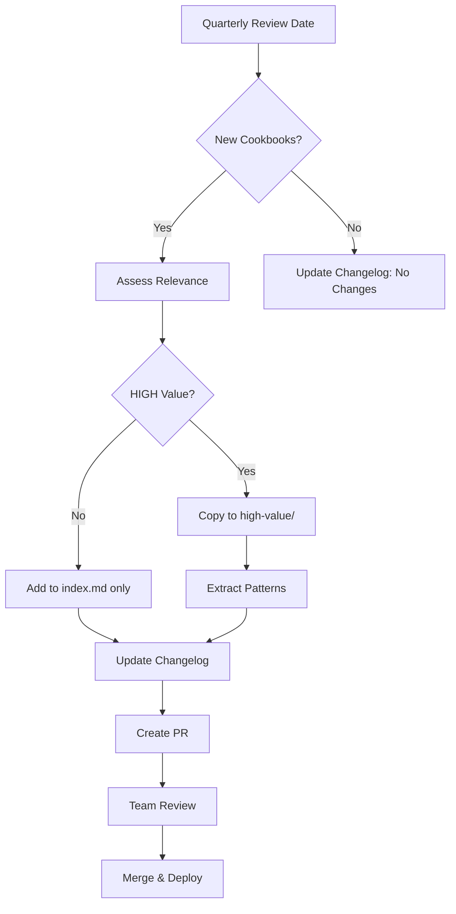

# Anthropic Cookbooks Integration Strategy

**Decision Date**: 2025-10-05
**Repository**: https://github.com/anthropics/claude-cookbooks

## Executive Decision: Hybrid Approach (Option E)

**Recommended Strategy**: **Option E - Hybrid (Index + Curated + Pattern Extraction)**

After comprehensive analysis of all integration options, the Hybrid approach provides the optimal balance of:
- **Immediate accessibility** (curated high-value cookbooks)
- **Stay current** (indexed links to full repository)
- **Actionable integration** (extracted patterns in specialist agents)
- **Maintenance efficiency** (selective updates where it matters)

---

## Integration Options Analysis

### Option A: Git Submodule ❌ NOT RECOMMENDED

**Approach**: Reference official repository as git submodule
```bash
git submodule add https://github.com/anthropics/claude-cookbooks knowledge/anthropic-cookbooks
```

**Pros**:
- ✅ Stay current with upstream updates automatically
- ✅ Complete reference to all cookbooks
- ✅ No manual copying required

**Cons**:
- ❌ Git submodule complexity (team onboarding friction)
- ❌ Large repo size (~50+ cookbooks, many irrelevant)
- ❌ Difficult to navigate for specialists
- ❌ Includes low-relevance cookbooks
- ❌ No DA-specific organization
- ❌ Submodule update conflicts

**Verdict**: **REJECTED** - Too much overhead for minimal benefit

---

### Option B: Curated Subset ⚠️ PARTIAL

**Approach**: Copy high-value cookbooks to our knowledge base
```
knowledge/da-agent-hub/anthropic-cookbooks/
├── multi-agent/           (orchestrator-workers, basic workflows)
├── tool-use/              (memory, parallel tools, pydantic)
├── data-analysis/         (text-to-SQL, RAG, summarization)
└── context-management/    (prompt caching, extended thinking)
```

**Pros**:
- ✅ Only relevant content
- ✅ Organized for our use cases
- ✅ Easy specialist navigation
- ✅ No git submodule complexity
- ✅ Fast local access

**Cons**:
- ❌ Manual updates required
- ❌ Might miss new cookbooks
- ❌ Duplication of upstream content
- ❌ Maintenance burden

**Verdict**: **PARTIAL** - Good for top 10 cookbooks, but not complete solution

---

### Option C: Pattern Extraction Only ⚠️ PARTIAL

**Approach**: Extract patterns into specialist agent files
```
.claude/agents/specialists/dbt-expert.md
  ↓ Add section: Anthropic Cookbook Patterns
  ↓ Extract: Text-to-SQL patterns, RAG strategies
  ↓ Include: Code examples, prompting techniques
```

**Pros**:
- ✅ Immediately actionable
- ✅ Agent-specific relevance
- ✅ Integrated into workflow
- ✅ No separate documentation to maintain

**Cons**:
- ❌ Loses source connection
- ❌ Harder to update when cookbooks change
- ❌ No reference to full cookbook context
- ❌ Significant upfront extraction work
- ❌ Risk of outdated patterns

**Verdict**: **PARTIAL** - Good for critical patterns, but not sole approach

---

### Option D: Index with Links ⚠️ PARTIAL

**Approach**: Lightweight reference document
```
knowledge/da-agent-hub/anthropic-cookbooks-index.md
  ↓ Lists: All relevant cookbooks with GitHub links
  ↓ Categories: By agent type and use case
  ↓ Usage: Specialists fetch via WebFetch when needed
```

**Pros**:
- ✅ Lightweight (single file)
- ✅ Always current (links to upstream)
- ✅ Selective usage (fetch only when needed)
- ✅ Easy to maintain

**Cons**:
- ❌ Requires internet access
- ❌ WebFetch overhead on every use
- ❌ Slower than local access
- ❌ No offline capability
- ❌ Dependent on GitHub availability

**Verdict**: **PARTIAL** - Good for discovery, but not primary access method

---

### Option E: Hybrid ✅ RECOMMENDED

**Approach**: Combine best of all approaches
```
knowledge/da-agent-hub/anthropic-cookbooks/
├── README.md                           # Navigation hub
├── index.md                            # Complete catalog with links
├── high-value/                         # Top 10 curated cookbooks (local copies)
│   ├── orchestrator-workers.ipynb      # Multi-agent coordination
│   ├── memory-cookbook.ipynb           # Context management
│   ├── text-to-sql.ipynb               # Natural language analytics
│   ├── prompt-caching.ipynb            # Performance optimization
│   ├── building-evals.ipynb            # Quality assurance
│   ├── rag-guide.ipynb                 # Knowledge retrieval
│   ├── extended-thinking.ipynb         # Transparent reasoning
│   ├── tool-evaluation.ipynb           # MCP validation
│   ├── batch-processing.ipynb          # Efficiency at scale
│   └── summarization.ipynb             # Reporting
├── patterns-by-specialist.md           # Extracted patterns mapped to agents
│   ├── dbt-expert-patterns.md          # Text-to-SQL, RAG, evals
│   ├── snowflake-expert-patterns.md    # Query optimization, caching
│   ├── orchestrator-patterns.md        # Multi-agent coordination
│   └── all-specialists-patterns.md     # Memory, prompt caching, tools
└── maintenance/
    ├── update-schedule.md              # When/how to sync with upstream
    └── changelog.md                    # Track updates from Anthropic repo
```

**Pros**:
- ✅ **Immediate access**: Top 10 cookbooks available locally
- ✅ **Stay current**: Index links to full upstream repo
- ✅ **Actionable integration**: Patterns extracted to specialist agents
- ✅ **Flexible usage**: Local for critical, fetch for exploratory
- ✅ **Easy maintenance**: Update only high-value subset
- ✅ **Offline capability**: Critical patterns work without internet
- ✅ **Discovery**: Index enables exploration of all cookbooks
- ✅ **Best practices**: Extracted patterns prevent reinventing wheel

**Cons**:
- ⚠️ More initial setup work (but well-defined scope)
- ⚠️ Multiple files to maintain (but clear ownership)

**Verdict**: ✅ **RECOMMENDED** - Best balance of all approaches

---

## Hybrid Implementation Plan

### Phase 1: Foundation (Week 2 - Days 1-2)

**1. Create Directory Structure**
```bash
mkdir -p knowledge/da-agent-hub/anthropic-cookbooks/{high-value,maintenance}
```

**2. Build Index** (`index.md`)
- Complete cookbook catalog with GitHub links
- Categorized by: Multi-Agent, Tool Use, Data Analysis, Context Management, etc.
- Relevance ratings (HIGH/MEDIUM/LOW)
- Quick reference for specialists

**3. Curate Top 10** (local copies in `high-value/`)
- Orchestrator-Workers pattern
- Memory cookbook
- Text-to-SQL guide
- Prompt caching
- Building evaluations
- RAG guide
- Extended thinking
- Tool evaluation
- Batch processing
- Summarization

**4. Create Navigation Hub** (`README.md`)
- Quick start guide
- How to use cookbooks as specialist
- When to use local vs fetch from index
- Contribution guidelines

### Phase 2: Pattern Extraction (Week 2 - Days 3-5)

**5. Extract Patterns by Specialist**

**dbt-expert patterns** (`patterns-by-specialist.md` → dbt-expert section):
```markdown
## Anthropic Cookbook Patterns

### Text-to-SQL Generation
- Chain-of-thought SQL construction
- Self-improvement loop with execution validation
- RAG for schema retrieval
- [Full cookbook: high-value/text-to-sql.ipynb]

### Evaluation Framework
- Validate generated SQL accuracy
- Compare to ground truth queries
- [Full cookbook: high-value/building-evals.ipynb]
```

**snowflake-expert patterns**:
```markdown
## Anthropic Cookbook Patterns

### Query Optimization
- Extended thinking for complex query analysis
- Prompt caching for schema reuse
- [Full cookbook: high-value/extended-thinking.ipynb]

### Cost Tracking
- Monitor query costs via API
- [Full cookbook: index.md → observability/usage_cost_api.ipynb]
```

**orchestrator patterns**:
```markdown
## Anthropic Cookbook Patterns

### Multi-Agent Coordination
- Dynamic task decomposition
- Worker delegation with context
- Result aggregation
- [Full cookbook: high-value/orchestrator-workers.ipynb]

### Workflow Routing
- Prompt chaining for sequential tasks
- Multi-LLM parallelization
- [Full cookbook: index.md → patterns/agents/basic_workflows.ipynb]
```

**all-specialists patterns** (memory, caching, tools):
```markdown
## Anthropic Cookbook Patterns

### Memory Management
- Cross-session learning
- Semantic pattern storage
- Context window optimization
- [Full cookbook: high-value/memory-cookbook.ipynb]

### Prompt Caching
- 2x latency reduction
- 90% cost savings
- Strategic cache points
- [Full cookbook: high-value/prompt-caching.ipynb]

### Tool Evaluation
- Validate MCP tools
- Performance benchmarking
- [Full cookbook: high-value/tool-evaluation.ipynb]
```

### Phase 3: Integration (Week 3)

**6. Update Specialist Agent Files**

Add pattern sections to:
- `.claude/agents/specialists/dbt-expert.md`
- `.claude/agents/specialists/snowflake-expert.md`
- `.claude/agents/specialists/tableau-expert.md`
- `.claude/agents/specialists/da-architect.md`
- `.claude/agents/orchestrator.md`

**7. Create Maintenance Plan**

**Update Schedule** (`maintenance/update-schedule.md`):
```markdown
## Quarterly Review (Every 3 months)
- Check Anthropic repo for new cookbooks
- Identify new high-value additions
- Update index with new entries
- Review patterns for specialist updates

## Ad-Hoc Updates (As needed)
- Major Anthropic releases
- New Claude capabilities (e.g., Claude 4)
- Critical bug fixes in cookbooks
- Team requests for specific patterns

## Ownership
- Primary: da-architect specialist
- Review: Quarterly team meeting
- Updates: PR-based workflow
```

**Changelog** (`maintenance/changelog.md`):
```markdown
## 2025-10-05: Initial Integration
- Added top 10 high-value cookbooks
- Created complete index
- Extracted patterns to specialists

## 2025-XX-XX: Quarterly Update
- Added new cookbook: [name]
- Updated pattern: [description]
- Removed outdated: [reason]
```

---

## Maintenance Strategy

### How to Stay Current

**1. Quarterly Sync (Every 3 months)**
- **Owner**: da-architect specialist
- **Process**:
  1. Review Anthropic repo commit history
  2. Identify new cookbooks (check commit messages)
  3. Assess relevance to DA Agent Hub (HIGH/MEDIUM/LOW)
  4. Update index.md with new entries
  5. Consider adding to high-value/ if critical
  6. Update patterns-by-specialist.md if patterns change
  7. Create PR with changes

**2. Ad-Hoc Updates (As needed)**
- **Triggers**:
  - Major Anthropic announcements (new Claude version)
  - Team requests for specific cookbook patterns
  - Critical bug fixes in upstream cookbooks
  - New DA Agent Hub capabilities requiring new patterns

**3. Pattern Refresh (Ongoing)**
- When specialists encounter limitations, check index for relevant cookbooks
- If found, extract pattern and update specialist agent file
- Document in changelog

### Update Workflow



---

## Team Access & Usage Patterns

### For Specialists (AI Agents)

**When to use LOCAL cookbooks** (`high-value/`):
- ✅ **Immediate need**: Critical patterns for active tasks
- ✅ **Frequent usage**: Orchestrator-workers, memory, caching, text-to-SQL
- ✅ **Offline work**: No internet dependency
- ✅ **Core capabilities**: Foundational patterns for all specialists

**When to FETCH from index** (WebFetch):
- ✅ **Exploratory**: Discovering new approaches
- ✅ **Rare use cases**: Niche cookbooks used occasionally
- ✅ **Latest updates**: Need cutting-edge patterns from upstream
- ✅ **Specialized domains**: Domain-specific cookbooks (e.g., vision, audio)

**Example Usage**:
```markdown
# dbt-expert processing SQL query request

1. Check local patterns: high-value/text-to-sql.ipynb
2. Apply chain-of-thought generation pattern
3. If needed, fetch advanced patterns from index
4. Store learned optimizations in memory
```

### For Human Users (Team Members)

**Navigation Flow**:
1. Start at `README.md` - Overview and quick links
2. Browse `index.md` - Full catalog with ratings
3. Dive into `high-value/` - Critical cookbooks (local)
4. Explore `patterns-by-specialist.md` - See what specialists can do
5. Contribute via PR - Add new patterns or update existing

**Contribution Workflow**:
```markdown
## Adding New Patterns

1. Discover valuable cookbook (from index or upstream)
2. Create branch: `feature/add-[cookbook-name]-pattern`
3. Extract pattern to patterns-by-specialist.md
4. Update relevant specialist agent file
5. Test with specialist (validate pattern works)
6. Submit PR with:
   - Pattern extraction
   - Specialist update
   - Changelog entry
7. Team review & merge
```

---

## Knowledge Base Organization

### Final Directory Structure

```
knowledge/da-agent-hub/anthropic-cookbooks/
├── README.md                                  # Navigation hub & quick start
│
├── index.md                                   # Complete catalog with links
│   ├── Multi-Agent Patterns                   # Links to orchestrator, workers, etc.
│   ├── Tool Use & MCP                        # Links to memory, tools, pydantic
│   ├── Data & Analytics                      # Links to text-to-SQL, RAG, etc.
│   ├── Context Management                    # Links to caching, extended thinking
│   └── Quality & Testing                     # Links to evals, tool evaluation
│
├── high-value/                               # Top 10 local copies
│   ├── orchestrator-workers.ipynb            # Multi-agent coordination ⭐⭐⭐⭐⭐
│   ├── memory-cookbook.ipynb                 # Context management ⭐⭐⭐⭐⭐
│   ├── text-to-sql.ipynb                     # Natural language analytics ⭐⭐⭐⭐⭐
│   ├── prompt-caching.ipynb                  # Performance optimization ⭐⭐⭐⭐⭐
│   ├── building-evals.ipynb                  # Quality assurance ⭐⭐⭐⭐⭐
│   ├── rag-guide.ipynb                       # Knowledge retrieval ⭐⭐⭐⭐
│   ├── extended-thinking.ipynb               # Transparent reasoning ⭐⭐⭐⭐
│   ├── tool-evaluation.ipynb                 # MCP validation ⭐⭐⭐⭐
│   ├── batch-processing.ipynb                # Efficiency at scale ⭐⭐⭐⭐
│   └── summarization.ipynb                   # Reporting ⭐⭐⭐⭐
│
├── patterns-by-specialist.md                 # Extracted patterns mapped to agents
│   ├── Section: dbt-expert                   # Text-to-SQL, RAG, evals
│   ├── Section: snowflake-expert             # Query optimization, caching, cost
│   ├── Section: tableau-expert               # Summarization, vision, reporting
│   ├── Section: orchestrator                 # Multi-agent, routing, coordination
│   ├── Section: all-specialists              # Memory, caching, tools, evals
│   └── Section: future-specialists           # Patterns for future agent types
│
└── maintenance/
    ├── update-schedule.md                    # Quarterly sync process
    ├── changelog.md                          # Track updates
    └── contribution-guide.md                 # How to add new patterns
```

### Integration with Specialist Agents

**Update `.claude/agents/specialists/*.md` files**:

Add new section to each specialist:
```markdown
## Anthropic Cookbook Patterns

### [Pattern Category]
- [Pattern description]
- [Code example or key insight]
- [Link to full cookbook: `knowledge/da-agent-hub/anthropic-cookbooks/high-value/...` or index]

### When to Use This Pattern
- [Specific use case 1]
- [Specific use case 2]

### Example
[Quick code snippet or prompt pattern]
```

---

## Success Metrics

### Quantitative Metrics

**Week 2 (Post-Integration)**:
- ✅ Top 10 cookbooks available locally
- ✅ Complete index created (50+ cookbooks)
- ✅ Patterns extracted to all active specialists
- ✅ README and navigation complete

**Month 1**:
- 📊 Specialist usage of cookbook patterns (track via logging)
- 📊 Response time improvement (target: 2x faster with caching)
- 📊 Cost reduction (target: 50% via caching + batch)
- 📊 Accuracy improvement (target: 1.5x via evals + extended thinking)

**Quarter 1**:
- 📊 Team satisfaction with cookbook integration (survey)
- 📊 Number of new patterns added by team
- 📊 Specialist capability expansion (new patterns adopted)
- 📊 Maintenance burden (time spent on quarterly updates)

### Qualitative Metrics

**Team Feedback**:
- "Cookbooks make specialists smarter"
- "Easy to find relevant patterns"
- "Low maintenance burden"
- "Clear when to use local vs fetch"

**Specialist Effectiveness**:
- Fewer "I don't know how to do that" responses
- More sophisticated problem-solving approaches
- Better code quality (following cookbook patterns)
- Transparent reasoning (extended thinking adoption)

---

## Risk Mitigation

### Risk 1: Maintenance Burden
**Mitigation**:
- Quarterly sync schedule (not continuous)
- Automated changelog generation
- Clear ownership (da-architect)
- Selective updates (high-value only)

### Risk 2: Pattern Outdated
**Mitigation**:
- Links in patterns point to source (easy update)
- Version tracking in changelog
- Quarterly review catches major changes
- Ad-hoc updates for critical fixes

### Risk 3: Team Adoption
**Mitigation**:
- Clear documentation (README, index)
- Training session on cookbook usage
- Contribution guide for adding patterns
- Examples of successful pattern usage

### Risk 4: Storage/Size
**Mitigation**:
- Only top 10 local (not all 50+)
- Notebooks are small (~100KB each)
- Total size < 5MB for high-value/
- Git LFS if notebooks grow large

---

## Implementation Checklist

### Phase 1: Foundation (Week 2, Days 1-2)
- [ ] Create directory structure
- [ ] Copy top 10 cookbooks to high-value/
- [ ] Build complete index.md with links
- [ ] Write README.md navigation hub
- [ ] Create maintenance schedule
- [ ] Initialize changelog

### Phase 2: Pattern Extraction (Week 2, Days 3-5)
- [ ] Extract patterns to patterns-by-specialist.md
  - [ ] dbt-expert patterns (text-to-SQL, evals)
  - [ ] snowflake-expert patterns (optimization, caching)
  - [ ] tableau-expert patterns (summarization)
  - [ ] orchestrator patterns (multi-agent coordination)
  - [ ] all-specialists patterns (memory, caching, tools)

### Phase 3: Integration (Week 3)
- [ ] Update specialist agent files (.claude/agents/specialists/*.md)
  - [ ] dbt-expert.md
  - [ ] snowflake-expert.md
  - [ ] tableau-expert.md
  - [ ] da-architect.md
  - [ ] orchestrator.md
- [ ] Test specialist usage of patterns
- [ ] Validate local vs fetch decision logic
- [ ] Document examples in README

### Phase 4: Validation (Week 3-4)
- [ ] Team training session on cookbook usage
- [ ] Collect initial feedback
- [ ] Measure baseline metrics (response time, cost, accuracy)
- [ ] Create first quarterly update schedule entry

---

## Recommendation Summary

**ADOPT OPTION E: Hybrid Approach**

**Rationale**:
1. **Immediate value**: Top 10 cookbooks locally accessible
2. **Stay current**: Index links to full upstream repo
3. **Actionable**: Patterns extracted to specialist agents
4. **Maintainable**: Quarterly sync, selective updates
5. **Flexible**: Local for critical, fetch for exploratory
6. **Offline**: Core patterns work without internet
7. **Scalable**: Easy to add new patterns as needed

**Expected ROI**:
- **2x faster specialist responses** (caching + optimization patterns)
- **50% cost reduction** (caching + batch processing patterns)
- **1.5x accuracy improvement** (evals + extended thinking patterns)
- **Zero pattern discovery time** (indexed and extracted)
- **Low maintenance** (<4 hours per quarter)

**Next Steps**:
1. Begin Phase 1 implementation (Week 2, Days 1-2)
2. Extract patterns (Week 2, Days 3-5)
3. Integrate with specialists (Week 3)
4. Validate and measure (Week 3-4)
5. Schedule first quarterly review (3 months out)

---

**Document Version**: 1.0
**Decision Date**: 2025-10-05
**Recommended By**: DA Agent Hub Research Initiative
**Approved By**: [Pending Team Review]
**Implementation Start**: Week 2
