# Role-Based Agent + MCP Integration Architecture Diagrams

## 1. Three-Layer Architecture Overview

## 2. Decision Flow: When to Use Each Layer

## 3. Confidence Level Enhancement via MCP

## 4. Integration Workflow Example: Infrastructure Audit

## 5. Comparison: Old vs New Architecture

### Old Architecture (Tool-Specific Agents)

### New Architecture (Role + MCP + Specialist)

## 6. MCP Tool Selection Matrix

```mermaid
graph TB
    TASK[Infrastructure Task] --> Q1{What do I need?}

    Q1 -->|Current State<br/>Resource Inventory| USE_API[Use aws-api MCP]
    Q1 -->|Latest Syntax<br/>Code Examples| USE_DOCS[Use aws-docs MCP]
    Q1 -->|Best Practices<br/>Governance| USE_KNOW[Use aws-knowledge MCP]

    USE_API --> API_EX[Examples:<br/>• List ECS services<br/>• Get Lambda configs<br/>• Query RDS instances<br/>• ALB listener rules]

    USE_DOCS --> DOCS_EX[Examples:<br/>• CloudWatch syntax<br/>• EventBridge patterns<br/>• IAM policy structure<br/>• Service quotas]

    USE_KNOW --> KNOW_EX[Examples:<br/>• Well-Architected pillars<br/>• Security patterns<br/>• Cost optimization<br/>• Compliance frameworks]

    API_EX --> RESULT[Enhanced Confidence<br/>Real-time Data<br/>Accurate State]
    DOCS_EX --> RESULT
    KNOW_EX --> RESULT

    style TASK fill:#E8E8E8,stroke:#999,stroke-width:2px
    style USE_API fill:#7ED321,stroke:#5FA319,stroke-width:3px
    style USE_DOCS fill:#7ED321,stroke:#5FA319,stroke-width:3px
    style USE_KNOW fill:#7ED321,stroke:#5FA319,stroke-width:3px
    style API_EX fill:#E5F7E5,stroke:#4CAF50,stroke-width:2px
    style DOCS_EX fill:#E5F7E5,stroke:#4CAF50,stroke-width:2px
    style KNOW_EX fill:#E5F7E5,stroke:#4CAF50,stroke-width:2px
    style RESULT fill:#B8E986,stroke:#8BC34A,stroke-width:2px
```

## 7. Specialist Consultation Triggers

```mermaid
graph TD
    START[Task Analysis] --> CONF{Confidence Level?}

    CONF -->|≥0.85| INDEPENDENT[Role Handles<br/>Independently<br/>80% of Tasks]
    CONF -->|<0.85| CHECK{Service Type?}

    CHECK -->|SageMaker| CONSULT1[aws-expert<br/>Confidence: 0.45]
    CHECK -->|EKS| CONSULT2[aws-expert<br/>Confidence: 0.50]
    CHECK -->|Step Functions| CONSULT3[aws-expert<br/>Confidence: 0.55]
    CHECK -->|Organizations| CONSULT4[aws-expert<br/>Confidence: 0.48]

    INDEPENDENT --> MCP[Use MCP Tools<br/>Direct Access]
    MCP --> IMPL1[Implement Solution]

    CONSULT1 --> EXPERT[Specialist Analysis<br/>Deep Patterns]
    CONSULT2 --> EXPERT
    CONSULT3 --> EXPERT
    CONSULT4 --> EXPERT

    EXPERT --> COLLAB[Collaborative<br/>Implementation<br/>20% of Tasks]
    COLLAB --> IMPL2[Implement Solution]

    IMPL1 --> OUT[Deliverable]
    IMPL2 --> OUT

    style START fill:#E8E8E8,stroke:#999
    style INDEPENDENT fill:#4A90E2,stroke:#2E5C8A,stroke-width:3px,color:#fff
    style MCP fill:#7ED321,stroke:#5FA319,stroke-width:2px
    style CONSULT1 fill:#FFE5E5,stroke:#FF6B6B,stroke-width:2px
    style CONSULT2 fill:#FFE5E5,stroke:#FF6B6B,stroke-width:2px
    style CONSULT3 fill:#FFE5E5,stroke:#FF6B6B,stroke-width:2px
    style CONSULT4 fill:#FFE5E5,stroke:#FF6B6B,stroke-width:2px
    style EXPERT fill:#F5A623,stroke:#C17D11,stroke-width:2px
    style COLLAB fill:#F5A623,stroke:#C17D11,stroke-width:2px
    style OUT fill:#B8E986,stroke:#8BC34A
```

## Legend

**Colors:**
- 🔵 Blue: Role-based agents (primary orchestrators)
- 🟢 Green: MCP tool layer (direct access)
- 🟠 Orange: Specialist agents (consultation)
- 🔴 Red: Low confidence areas (need specialist)
- ⚪ Gray: User input / neutral states
- 🟩 Light Green: Success / completion states

**Metrics:**
- **Confidence ≥0.85**: Independent handling by role agent
- **Confidence <0.85**: Specialist consultation needed
- **80/20 rule**: 80% independent, 20% consultation
- **50-70% faster**: Proven coordination reduction

---

## Key Takeaways from Diagrams

1. **Three-Layer Architecture**: Role (orchestrator) → MCP (tools) → Specialist (consultant)
2. **Direct MCP Access**: Roles use tools directly for enhanced capability (+0.05 to +0.30 confidence)
3. **Confidence-Driven Delegation**: ≥0.85 independent, <0.85 consult specialist
4. **Efficiency Gains**: 50-70% coordination reduction vs old tool-specific agents
5. **Tool Selection**: aws-api (state), aws-docs (syntax), aws-knowledge (best practices)

These diagrams illustrate the recommended architecture for integrating role-based agents with MCP servers and specialist consultants, based on Anthropic guidance and industry best practices.
