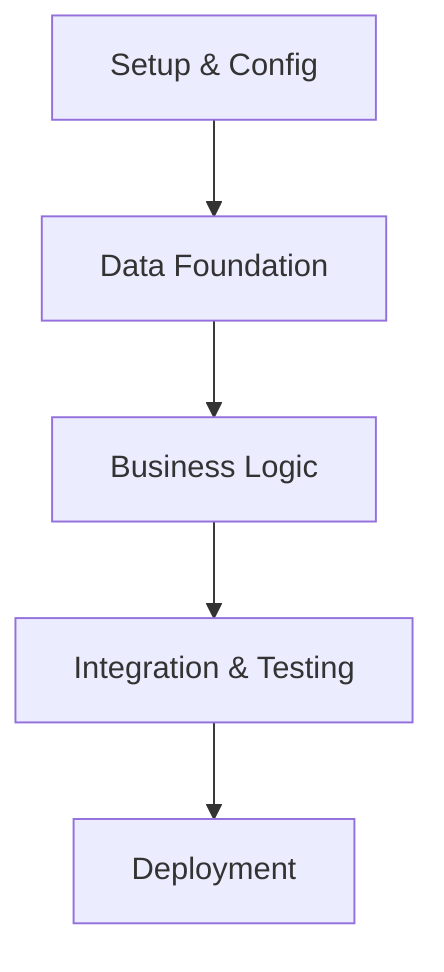

# Data Analytics Tasks: [FEATURE]

**Branch**: `[###-feature-name]` | **Date**: [DATE] | **Spec**: [link] | **Plan**: [link]
**Generated from**: Implementation plan and design documents

## Task Overview
**Total Tasks**: [COUNT]  
**Estimated Duration**: [TIMEFRAME]  
**Sub-Agents Required**: [LIST]

## Execution Strategy

### Sequential Dependencies


### Parallel Execution Opportunities
Tasks marked with **[P]** can be executed in parallel when they don't modify the same files or depend on each other's outputs.

---

## Setup & Configuration Tasks

### T001: Environment Setup
**Owner**: Parent Agent  
**Dependencies**: None  
**Files**: `config/`, `.env`, `dbt_project.yml`  
**Description**: Initialize project structure and tool configurations
- Create dbt project structure
- Configure Snowflake connection parameters
- Set up Tableau Server connection
- Initialize Orchestra workspace
**Acceptance**: All tools can connect to their respective services

### T002: Database Schema Foundation
**Owner**: snowflake-expert  
**Dependencies**: T001  
**Files**: `snowflake/schemas/`  
**Description**: Create base database objects and permissions
- Create raw, clean, and presentation schemas
- Set up service account permissions
- Create initial table structures for staging
**Acceptance**: dbt can read/write to all required schemas

### T003: Repository and Branch Structure
**Owner**: Parent Agent  
**Dependencies**: None  
**Files**: Repository root  
**Description**: Set up version control and collaboration structure
- Initialize feature branch workflow
- Set up dbt model organization
- Create documentation structure
**Acceptance**: All team members can collaborate on shared structure

---

## Data Foundation Tasks *(can execute in parallel)*

### T004: Source Data Validation [P]
**Owner**: dbt-expert  
**Dependencies**: T002  
**Files**: `models/staging/`, `tests/`  
**Description**: Validate and profile source data quality
- Create data profiling queries
- Implement source data quality tests  
- Document data quality findings
- Create source freshness tests
**Acceptance**: Source data quality baseline established

### T005: dbt Staging Models [P]
**Owner**: dbt-expert  
**Dependencies**: T004  
**Files**: `models/staging/stg_*.sql`, `models/staging/_sources.yml`  
**Description**: Create initial data transformation layer
- Build staging models for each source system
- Implement column-level data quality tests
- Add documentation and lineage
**Acceptance**: All staging models pass tests and compile

### T006: Snowflake Raw Schema Optimization [P]
**Owner**: snowflake-expert  
**Dependencies**: T002  
**Files**: `snowflake/schemas/`, `snowflake/permissions/`  
**Description**: Optimize raw data storage and access patterns
- Set up clustering keys for large tables
- Implement row-level security if needed
- Create materialized views for common access patterns
**Acceptance**: Query performance meets SLA requirements

### T007: Orchestra Pipeline Skeleton [P]
**Owner**: orchestra-expert  
**Dependencies**: T001  
**Files**: `orchestration/pipelines/`  
**Description**: Create basic pipeline structure and monitoring
- Define job dependencies and schedules
- Set up failure notifications
- Create basic data quality monitoring
**Acceptance**: Pipeline can execute dbt runs on schedule

---

## Business Logic Implementation Tasks

### T008: dbt Intermediate Models
**Owner**: dbt-expert  
**Dependencies**: T005  
**Files**: `models/intermediate/int_*.sql`  
**Description**: Implement core business logic transformations
- Create reusable business logic models
- Implement complex calculations and aggregations
- Add comprehensive testing for business rules
**Acceptance**: All business logic calculations match specifications

### T009: dbt Mart Models  
**Owner**: dbt-expert  
**Dependencies**: T008  
**Files**: `models/marts/dim_*.sql`, `models/marts/fct_*.sql`  
**Description**: Create final presentation layer models
- Build dimension and fact tables
- Implement slowly changing dimension logic
- Optimize for dashboard consumption patterns
**Acceptance**: Mart models support all required dashboard use cases

### T010: Tableau Data Source Optimization [P]
**Owner**: tableau-expert  
**Dependencies**: T009  
**Files**: `tableau/datasources/`  
**Description**: Create optimized Tableau data sources
- Build live connections to mart tables
- Create calculated fields for common metrics
- Implement row-level security integration
**Acceptance**: Dashboard queries perform within SLA

### T011: Snowflake Query Optimization [P]
**Owner**: snowflake-expert  
**Dependencies**: T009  
**Files**: `snowflake/optimization/`  
**Description**: Optimize warehouse performance for analytics workload
- Implement query result caching
- Set up auto-clustering for fact tables
- Create search optimization for dimension lookups
**Acceptance**: All dashboard queries under 2 second response time

---

## Integration & Testing Tasks

### T012: End-to-End Pipeline Testing
**Owner**: orchestra-expert  
**Dependencies**: T007, T009  
**Files**: `orchestration/testing/`, `tests/integration/`  
**Description**: Test complete data pipeline from source to presentation
- Create integration test data sets
- Validate data flow through all transformation stages
- Test failure scenarios and recovery
**Acceptance**: Pipeline processes test data correctly end-to-end

### T013: Dashboard Accuracy Validation [P]
**Owner**: tableau-expert  
**Dependencies**: T010  
**Files**: `tableau/workbooks/`, `tests/dashboard/`  
**Description**: Create and validate dashboard implementations
- Build dashboard prototypes with stakeholders
- Validate calculations against business requirements
- Test dashboard performance with production data volumes
**Acceptance**: Dashboards match all business requirements

### T014: Data Quality Monitoring [P]
**Owner**: dbt-expert + orchestra-expert  
**Dependencies**: T008, T012  
**Files**: `models/tests/`, `orchestration/monitoring/`  
**Description**: Implement comprehensive data quality monitoring
- Create business metric validation tests
- Set up automated anomaly detection
- Implement alerting for data quality failures
**Acceptance**: System detects and alerts on all critical data issues

### T015: Performance and Scale Testing [P]
**Owner**: snowflake-expert  
**Dependencies**: T011  
**Files**: `tests/performance/`  
**Description**: Validate system performance under expected load
- Test with projected data volumes
- Validate concurrent user performance
- Optimize based on performance test results
**Acceptance**: System meets all performance SLAs

---

## Deployment & Go-Live Tasks

### T016: Production Environment Setup
**Owner**: Parent Agent + Sub-Agents  
**Dependencies**: T012, T013, T014, T015  
**Files**: `deployment/`, `config/prod/`  
**Description**: Deploy solution to production environment
- Set up production data connections
- Deploy dbt models to production
- Configure production Tableau server
- Set up production Orchestra jobs
**Acceptance**: All components deployed and functional in production

### T017: User Training and Documentation
**Owner**: business-context + Parent Agent  
**Dependencies**: T013  
**Files**: `documentation/`, `training/`  
**Description**: Prepare end users for system adoption
- Create user guides for dashboards
- Conduct training sessions with stakeholders
- Document troubleshooting and support procedures
**Acceptance**: Users can effectively use new system

### T018: Go-Live Coordination
**Owner**: Parent Agent  
**Dependencies**: T016, T017  
**Files**: `deployment/go-live/`  
**Description**: Coordinate production launch and initial monitoring
- Execute go-live checklist
- Monitor system performance for first week
- Address any immediate issues or user feedback
**Acceptance**: System stable in production with user adoption

---

## Parallel Execution Examples

### Phase 1: Foundation (can run concurrently)
```bash
# Launch parallel tasks for data foundation
Task run T004 T005 T006 T007  # All can execute simultaneously
```

### Phase 2: Business Logic (mixed parallel/sequential)
```bash
# Sequential within dbt, parallel across tools
Task run T008                 # Must complete first
Task run T009 T010 T011      # Can run in parallel after T008
```

### Phase 3: Testing (can run concurrently)
```bash
# All testing can happen in parallel once foundations are ready
Task run T013 T014 T015      # Independent validation workstreams
```

## Sub-Agent Coordination

### Task Handoff Protocol
1. **Predecessor Agent**: Updates task status to "completed" and documents findings in `findings/[task-id].md`
2. **Successor Agent**: Reads predecessor findings and updates task status to "in_progress"
3. **Parent Agent**: Monitors overall progress and coordinates cross-tool integration points

### Critical Integration Points
- **T005 → T008**: dbt staging to intermediate model handoff
- **T009 → T010**: dbt mart to Tableau data source handoff  
- **T011 → T013**: Snowflake optimization to dashboard performance validation
- **T012 → T016**: Integration testing to production deployment

---

## Risk Mitigation

### High-Risk Tasks
- **T004** (Source Data Validation): Could reveal data quality issues requiring spec changes
- **T010** (Tableau Optimization): Dashboard performance might require mart model redesign
- **T015** (Performance Testing): May require architecture changes if SLAs not met

### Mitigation Strategies
- Early stakeholder validation at each phase
- Incremental testing with production-like data volumes
- Cross-tool performance validation before final implementation
- Regular checkpoint reviews with business stakeholders

---

**Task Generation Completed**: [TIMESTAMP]  
**Ready for Implementation**: Yes  
**Next Step**: Execute setup tasks T001-T003 sequentially